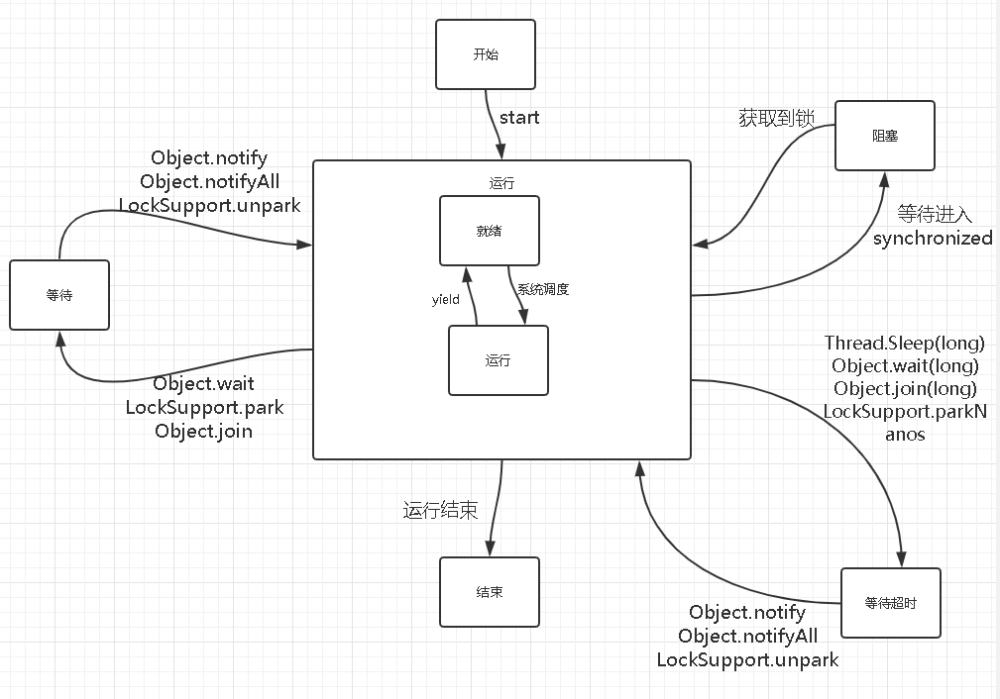
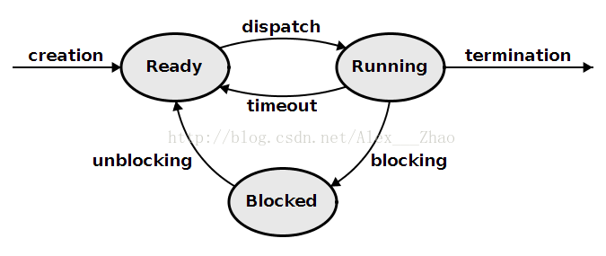

## 操作系统线程
线程是操作系统调度的最小单位，一般分为两类，内核线程与用户线程。
- 内核线程（Kernel Level Thread，`KLT`）：内核负责调度的线程，只能运行在内核态（可以访问所有设备和数据）。
- 用户线程（User Thread，`UT`）：由用户线程负责调度，内核无法感知，只能运行在用户态（访问内存），只能访问用户空间

### 线程的实现方式
#### 1对1
内核线程和用户线程1对1映射，内核通过操纵调度器（`Scheduler`）对线程进行调度。程序一般不会直接使用内核线程，而是使用内核线程的一种高级接口--轻量级进程（Light Weight Process，`LWP`）。

#### 1对N
1对1由于基于内核线程实现，线程的创建，调度都需要进行系统调用，进而需要在用户态和内核态来回切换。同时，每个`LWP`都需要内核线程支持，会消耗内核资源，所以`LWP`是有限的。
基于此，把用户线程的建立、同步、销毁和调度都在用户态中完成，不需要内核的帮助，就可以节省资源，提升效率。
这种一个进程与用户之间1：N的关系称为1对多的线程模型。

#### M对N
1对N虽然节约了资源与提升了效率，但没有内核线程的支持，有些问题是很难实现，甚至无法解决的。
基于此，将内核线程与用户线程一起使用，用户线程的创建、调度、销毁等操作依然在用户态完成，需要内核操作的，通过`LWP`作为桥梁来完成，

### 抢占式和非抢占式
linux2.6版本升级为抢占式内核，非抢占式优点是资源竞争小，可控制；缺点是响应慢，需要等待释放，出问题了就死了
- 非抢占式内核：由消息队列管理顺序执行，直到任务主动让出内核资源，才能切换下一个任务
- 抢占式内核：由系统时钟管理，时间片结束后，由最高优先级任务抢占内核资源

## JAVA线程与操作线程对应
在JDK1.2之前，是基于“绿色线程”的用户线程实现的，是1对多的线程模型。
在JDK1.3起，采用基于操作系统原生线程模型来实现，java线程就是操作系统的用户线程，与操作系统1对1线程模型。

## JAVA线程调度
因为是1对1线程模型，调度是由内核线程调用调度器达成的。

## JAVA线程状态与操作系统线程状态

java线程的BLOCKED，WAITING，TIMED_WAITING都属于blocked

## 参考

[深入理解JVM（③）线程与Java的线程](https://www.cnblogs.com/jimoer/p/13283355.html)

