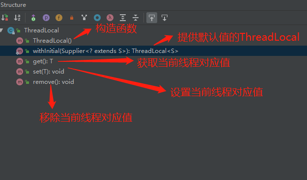
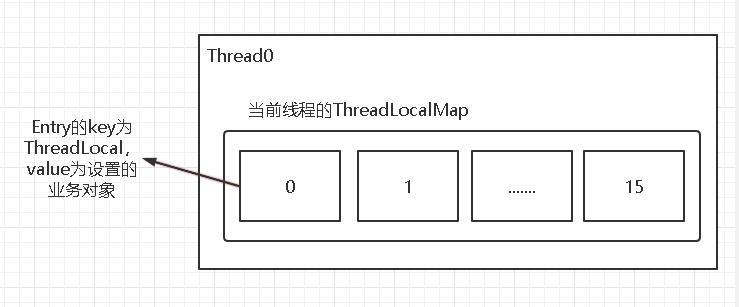

ThreadLocal是一种线程隔离机制，为了保证多线程下访问共享变量的安全性。

get、set、remove都是针对ThreadLocalMap实现的，结构如下

## ThreadLocalMap
### 获取ThreadLocal对应线程map位置
ThreadLocalMap使用散列算法-斐波那契通过初始值0x61c88647，每个ThreadLocal
进行加1获取散列值

### 解决冲突
ThreadLocalMap运用线性探测解决冲突，当key冲突时，从当前位置向后找空的位置
- 当前entry为空，未冲突，直接赋值
- 当前entry有值
  - key相同，未冲突，直接覆盖
  - 当前entry的key为null，设置新值，并清理后续entry有值，key为null的
  - key不同，向后查找entry为有值key为null的，或者entry为null的

### 内存泄漏
ThreadLocal为了避免创建的ThreadLocal已经销毁了（比如在方法内部创建ThreadLocal，方法调用完成），但线程一直存在（线程池线程复用），ThreadLocal和对应value得不到释放（因此，用完ThreadLocal后要调用写remove，从当前线程ThreadLocalMap中移除），把Entry的key设计为是弱引用。
当GC时，不在具有强引用的`Entry key`就会被置为null，但这个时候value并不会被释放。
所以ThreadLocalMap设计当修改值时会去清理这些应该被释放的Entry。

