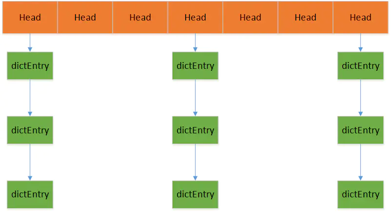
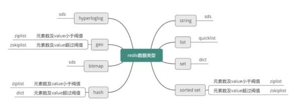
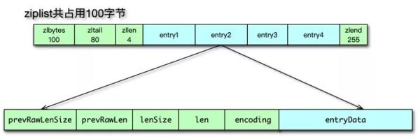
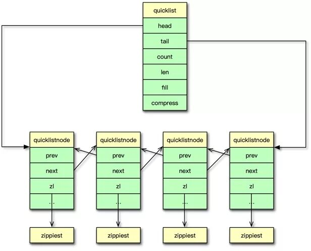
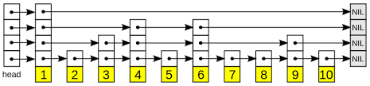
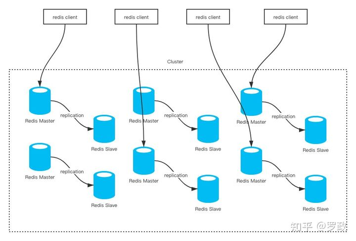
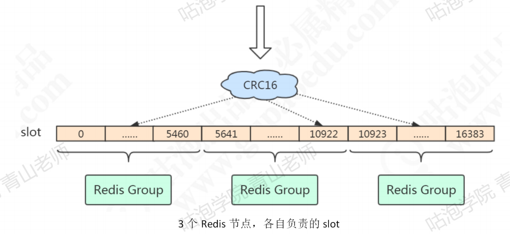

## Redis 有几种数据结构？Zset 是如何实现的？
Redis最外层是一个hash表，每个key对应一个dictEntry，dictEntry中val指向redisObject，再由redisObject指向真正的存储位置。

```java
typedef struct dictEntry {
    
    // 键
    void *key;

    // 值
    union {
        void *val;
        uint64_t u64;
        int64_t s64;
    } v;

    // 指向下个哈希表节点，形成链表
    struct dictEntry *next;

} dictEntry;
```
```java
typedef struct redisObject {

    // 类型
    unsigned type:4;

    // 编码
    unsigned encoding:4;

    // 对象最后一次被访问的时间
    unsigned lru:REDIS_LRU_BITS; /* lru time (relative to server.lruclock) */

    // 引用计数
    int refcount;

    // 指向实际值的指针
    void *ptr;

} robj;
```

各基础类型对应的存储结构

### 1、String
#### 1.1、存储类型
- int：正数
- float：浮点数
- String：字符串
#### 1.2、存储结构
String在redis是一个`SDS（Simple Dynamic String简单动态字符串）`结构，底层是一个char[]，针对不同情况有三种类型：
1. int：8个字节的长整型
2. embstr：小于44个字节的字符串，只分配一次空间，改变就变为raw
3. raw：大于44个字节的字符串
这样设计可以更充分的利用内存空间。
#### 1.3、应用场景
- 缓存
- 分布式session
- 分布式锁
- 全局Id，因为是单线程
- 计数器
### 2、Hash
#### 2.1、存储类型
无序的键值对
#### 2.2、存储结构
使用`ziplist`和`hashtable`存储，当hash对象键值对（value只能为字符串）小于512个并且键值对长度都小于64byte时使用`ziplist`，其余使用`hashtable`。

- ziplist
  - 连续内存组成的双向链表
  - 不存储指向上一节点和下一节点的指针，而是存储上一节点长度和当前节点长度。时间上慢一点，但可以节省内存空间

- hashtable：数组+链表

#### 2.3、应用场景
String的应用场景+多个键值对的存储
### 3、List
#### 3.1、存储类型
有序的字符串
#### 3.2、存储结构

- 使用`quicklist`，是双向链表+`ziplist`
- 将原先的双向链表，按段切分，每一段称为一个`quicklist node`，`quicklist node`使用`ziplist`来紧凑存储，多个`quicklist node`之间用指针连接起来
#### 3.3、应用场景
- 列表
- 队列/栈，因为维护了开头结尾指针，从开头结尾存取数据都是O（1）的
### 4、Set
#### 4.1、存储类型
String类型的无序集合
#### 4.2、存储结构
使用`intset`或者`hashtable`存储
- 当存储元素都为int并且小于512个时，使用`intset`存储，其余使用`hashtable`
- `intset`内部是一个有序数组，使用二分查找插入、删除、查询
#### 4.3、应用场景
- 抽奖
- 无序列表
### 5、Zset
#### 5.1、存储类型
有序的元素，不允许重复
#### 5.2、存储结构
使用`ziplist`或者`skiplist`
- `Zset`长度小于128并且key长度小于64byte使用`ziplist`，其余使用`skiplist`
- `skiplist`通过维护不同层级的指针来达到二分搜索的效果，空间换时间

#### 5.3、应用场景
- 排行榜
- 延迟队列

### 6、其他
- BitMaps：位操作
- HyperLogLogs：不太精确的基数统计，一个集合中不重复的元素个数
- GEO：存储地理位置信息
## 简述 Redis 持久化中 rdb 以及 aof 方案的优缺点
### 持久化机制
Redis快很大一部分原因是因为它数据都是存储在内存中，当断电或重启就会存在数据丢失，为了实现重启后数据不丢失，Redis提供了两种数据持久化方案rdb（Redis DataBase快照）和aof（AppendOnlyFile）。默认是使用rdb，当开启了aof时，优先使用aof。
#### rdb
- 触发方式
  - 自动触发：我们可以设置自动触发的规则（save+时间间隔单位秒+保存key数量），有多个规则时，规则都会生效。比如save 100 10就是100秒至少10个key被修改，就触发保存。当shutdown的时候也会生成快照dump.rdb ，在安装根目录下。
  - 手动触发
    - save：会阻塞Redis服务器
    - bgsave：fork一个子进程进行快照，不会影响redis的使用，fork之后的修改不会保存到快照中
- 恢复：Redis启动时会自动恢复数据

#### aof
- 备份方式：redis会将所有命令追加到文件中，当redis重启时，会将命令重新执行一次。当追加命令越来越多，aof文件越来越大时，Redis会对根据存在的key对key命令操作进行重写（可以设置重写key操作的文件大小，也可以手动通过`bgrewriteaof`）。
- 启用方式：设置appenonly为yes

### rdb与aof优缺点
- rdb
  - 优点
    - 相对aof，数据格式更合适备份与容灾，没有重复命令那些
    - 恢复数据时比aof快
    - 备份数据时是子进程备份，不影响redis使用
  - 缺点
    - 快照之后的修改数据会丢失（无法频繁的做持久化，因为是创建子进程方式，频繁执行，代价太高）
- aof
  - 优点
    - 数据丢失较少
  - 缺点
    - 备份文件体积更大，恢复更慢
    - 高并发下，频繁append没有rdb子进程方式效率高
## Redis 如何实现延时队列，分布式锁的实现原理
### 延时队列
可以使用zset做延时队列，用设置好的时间戳作为score进行排序。查询时用zrangebyscore查询符合条件的待处理的任务。
- 优势
  - 在内存上操作，速度快
  - 高性能的score排序
  - redis有持久化，数据不会丢失

- 劣势
  - 没有重试机制
  - 没有ACK机制，无法保证消息被正确消费
### 分布式锁
分布式锁的基本要求：
- 互斥性：只有一个客户端能持有锁
- 不会产生死锁：即使持有锁的客户端过期了，其他客户端也要可以获取锁
- 只有持有锁的客户端才能解锁

#### 加锁
```java
SET key requestId NX PX 300
```
- key：分布式锁的key
- requestId：表明是哪个客户端，加锁的才能释放锁（除了锁过期）
- NX：设置值如果不存在
- PX：过期时间单位，PX为毫秒，也可以设置秒为EX
- 300：过期时间长度
#### 释放锁
为了避免误解锁，不是持有锁的客户端解了锁，两个客户端A与B，A持有锁，锁解锁判断时A客户端id对上，准备解锁，这时锁过期时间到达，B获取到了锁，A继续解锁，A就解掉了不属于自己自己的锁。为了解决这个问题，使用lua脚本原子解锁。
```java
if redis.call("get",KEYS[1]) == ARGV[1] then
        return redis.call("del",KEYS[1])
    else
        return 0
    end
```
## 简述 Redis 中如何防止缓存雪崩和缓存击穿
### 缓存雪崩
Redis大量的热点数据同时过期（因为设置了相同的过期时间），大量请求落在数据库上，称为**缓存雪崩**。单个的热点数据失效，导致大量请求落在数据库上称为**缓存击穿**。
- 解决方法
  - 加互斥锁，针对同一个热点key，只允许一个线程去数据库获取数据（其余没抢到锁的线程都再次获取，再次获取时，前面抢到锁的线程将对应key缓存加到redis里了）
  - 定时更新缓存，避免失效
  - 设置key的过期时间时，加随机数，避免同时失效
  - 设置缓存永不过期
### 缓存穿透
访问的值在`redis`和数据库中都没有，可能是由于程序错误或者恶意攻击。
- 解决方法
  - 缓存空值或者特殊字符：需要设置过期时间，并且无法解决每次查询都是**不一样的不存在值**得问题。
  - 布隆过滤器：缓存数据库现有值，当有查询来时，可以判断这个值是否存在，两种情况1）判断值存在，由于hash冲突，值可能是不存在的（即布隆过滤器有一定误判性）。2）判断值不存在，值肯定不存在。这样就只有很少的误判值才能去查询数据库。todo补一批讲解布隆过滤器的

## 假设Redis 的 master 节点宕机了，你会怎么进行数据恢复？
- 单节点部署：只有重启
- 主从复制：可以通过命令把从节点设置成主节点，在把原先的master节点重启设置为从节点
- 哨兵：会自己主动地切换从节点为master
- 集群：会自己主动地切换从节点为master
### 主从复制
主要是为了避免单机出现故障，数据无法恢复的影响。没有解决高可用的问题
- 配置方式：只需要在从节点配置`replicaof 主节点ip 主节点port`，或者直接通过命令slaveof指定当前节点的主节点。
- 复制方式：第一次会全量复制（RDB方式）， 后续主节点会异步把写命令同步给从节点。对于那些中途挂掉的从节点，有一个偏移量offset，可以达到增量复制

### Sentinel
Sentinel哨兵实现了高可用，能够实现Redis的主从切换，并且客户端使用时会自动切换到主节点上去。

#### 1、Sentinel功能
- 监控：Sentinel会不断通过ping检查主从服务器是否正常。
- 通知：如果监控的服务器出现问题，Sentinel可以通过API发送通知。
- 自动故障转移：当主服务器发生故障时，会把某台从服务器升级为主服务器。
- 配置管理：客户端连接到Sentinel，获取Redis主服务器地址。

#### 2、Sentinel缺点
- 主从切换时，会存在数据丢失
- 只能单点写，没有解决水平扩容的问题
### Redis Cluster
Redis Cluster实现了高可用与水平扩展。多个master节点，当master挂掉时，会用master对应从节点竞争为主节点。可以动态的添加下线一组服务节点。

#### 1、集群结构

- 节点之间两两交互，共享数据分片，节点状态等信息
- 每个master节点有对应的从节点，好做故障转移
- 客户端只需要配置一个主节点地址，客户端会本地存储集群和slot信息

#### 2、数据存储

- 每个`redis组（一个master，多个salve）`负责一段slot
- 数据存储与获取：key通过CRC16散列算法在与slot长度取余，可以得到数据应该落在哪个slot上，进而得到数据应该在那个redis服务器上。如果想让相关联的key都落在一个redis上，可以在key里加{相同符号}，`Redis Cluster`会解析{}中计算slot位置
- 数据迁移：当新增了节点，需要把原先负责这一段slot的redis数据迁移到新节点上来，因为key与slot的对应位置是不会变得
- 客户端重定向：当slot与redis的对应关系发生改变，而客户端有缓存没有更新，去操作的key不在原先的redis上，服务端就会返回MOVED告诉客户端。客户端需要连接两次（需要客户端支持，叫做`smart jedis`），并且客户端更新slot与redis关系。

#### 3、总结
- 无中心结构
- 数据按照slot存储在多个节点上，节点间数据共享
- 水平扩展，节点可动态添加删除
- 高可用性，节点之间通过gossip协议交换状态信息，用投票机制（只有master能投票）完成slave到master节点的升级

## Redis的缓存淘汰策略有哪些？
### 过期策略
1.立即过期：每一个带过期时间的key都有一个定时器，到点马上过期，对cpu不友好，定时器可能会非常多
2.惰性过期：当访问时才判断是否过期，对内存不友好
3.定时过期：每隔一段时间，扫描一定数量key，清除过期key
`Redis`是定时过期与惰性过期结合
### 淘汰策略
- noeviction：默认策略，不会删除任何数据，写入时报OOM错误
- volatile-ttl：删除最近将要过期的数据（根绝ttl排序）。没有的化，写入时也报OOM错误
- volatile-lru：根据LRU算法删除设置了超时时间的key。
- allkeys-lru：根据LRU算法删除所有key
- volatile-lfu：删除设置了过期时间的key中最不常用的
- allkeys-lfu：删除所有key中最不常用的
- volatile-random：随机删除设置了过期时间的key
- allkeys-random：随机删除所有key

`LRU`和`LFU`的区别是`LRU`淘汰的是最近最不常使用的，`LFU`淘汰的是最少使用的（根据频率），举例A10秒访问3次，B10秒2次，B后访问，按`LRU`淘汰的就是A，按`LFU`就是淘汰B。
设置淘汰策略，可以从三个维度设置
1.是否要淘汰
2.淘汰的方式
3.淘汰的范围

## 为什么 Redis 在单线程下能如此快？
- 纯内存结构：用`hash表`，时间复杂度O（1）
- 单线程操作：没有创建销毁线程开销，没有切换线程开销，没有加锁释放锁这些开销
- IO多路复用：监听多个socket fd，减少内核空间到用户空间的数据拷贝

## 参考

咕泡学院

[聊一聊 Redis 数据内部存储使用到的数据结构](https://stor.51cto.com/art/202007/620929.htm)


