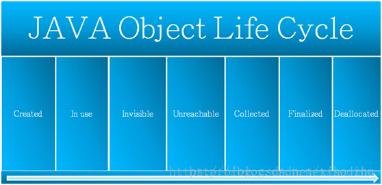
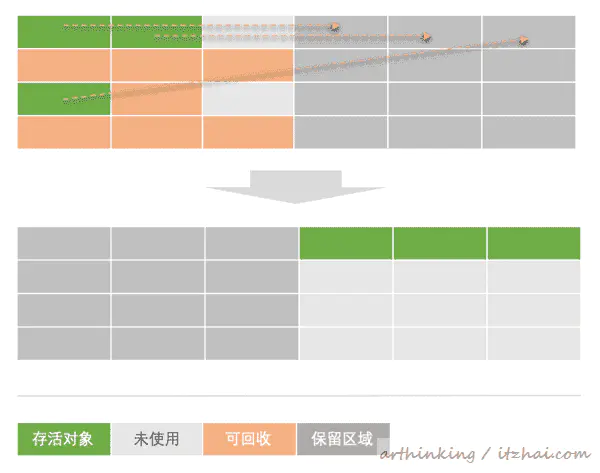
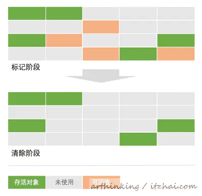
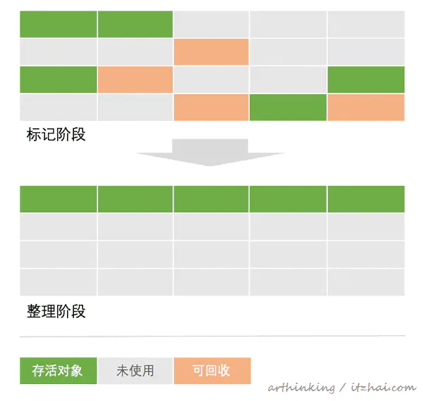
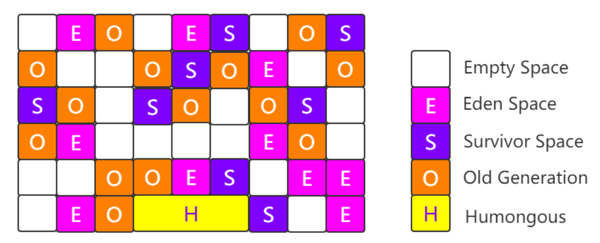

## Java垃圾回收机制如何判断对象需要回收

可达性分析法，从GC ROOTS开始搜索，搜索不到的对象（如果覆盖了finalized方法，需要执行完finalized方法，还是不可达），这些对象需要回收，GC会进行响应的内存重分配。

可以作为GC ROOTS的有下面四种

- 虚拟栈引用对象
- 方法区中类静态属性引用对象
- 方法区中常量引用对象
- 本地方法栈（Native）引用对象

### Java垃圾回收的时机
- eden区或者survivor区不够用了，触发minor GC
- old区满了，触发full GC
- System.gc()，不是立即执行，只是通知JVM，执行时间JVM决定
- 方法区满了

## 常见的GC回收算法
### 标记-复制

将内存划分为两块区域，一块使用完了，就将还存活对象复制到另一块上，然后一次将使用过的内存清理掉。
- 缺点：空间利用率低

### 标记-清除

找出内存中需要清除的对象，并把它们标记出来，清除掉被标记需要清除的对象。
- 缺点
  - 标记和清除都比较耗时（耗时点在于需要扫描整个内存）
  - 产生内存碎片，后续给大对象分配空间时，可能会触发GC

### 标记-整理

- 缺点：和标记-清除一样，标记整理比较耗时，需要扫描整个内存

### 分代收集算法
分代收集算法并没有具体的执行步骤，它指的是在堆中，young区用标记-复制收集，old区用标记-清理或者标记-整理。
因为young区对象大多都是朝生夕死，淘汰很快，而标记-复制效率高，只需扫描GC ROOTS，并且内存默认分配是8:1:1，专门设计了survivor大小比例刚好适合算法。
而old区没有那么大的空间区专门做复制，old区的对象也比较稳定。

### 垃圾收集器
#### Serial（新生代：标记-复制）
单线程收集器，收集时暂停其他线程
- 优点：高效，单线程收集效率高
- 缺点：需要暂停所有线程

#### Serial Old（老年代：标记-整理）
Serial的老年代版本

#### ParNew（新生代：标记-复制）
Serial的多线程版本，多CPU时，效率比Serial高

#### Parallel Scavenge（新生代：标记-复制）
基本与ParNew一样，但更关注吞吐量（运行用户代码时间/(运行用户代码时间+垃圾收集时间)），即GC消耗时间

#### Parallel Old（老年代：标记-整理）
Parallel Scavenge的老年代版本，更关注吞吐量

#### CMS（老年代：标记-清除）
并发标记与并发清除，可以与用户线程一起工作，追求最短停顿时间。
- 优点：并发收集，低停顿
- 缺点：产生空间随便，降低吞吐量

#### G1
将Java堆划分为多个独立区域（Region），新生代与年老代不再是物理隔离的了，每个Region大小1M-32M，对象太大，直接放入H中。依然是分代收集，整体上是标记-整理，不会有内存碎片，支持指定的停顿时间

