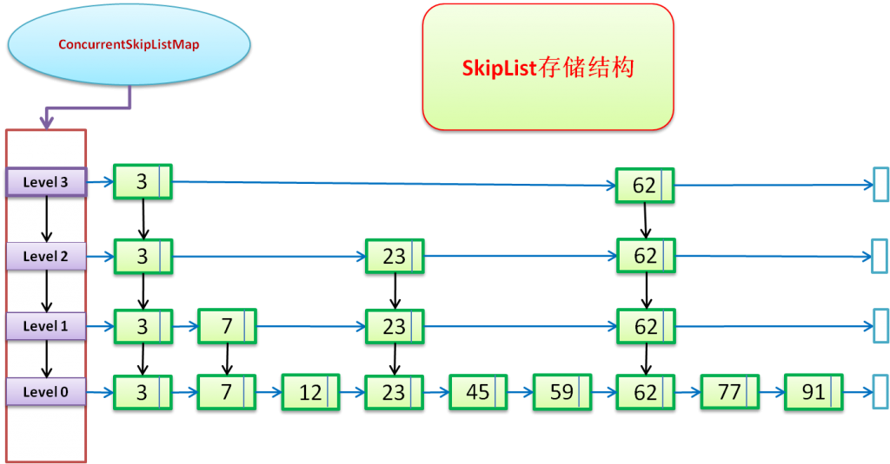

## 线程安全版本List

### SynchronizedList与Vector

都是通过synchronized关键字加在方法上来达到线程安全的

### CopyOnWriteArrayList
通过在修改方法add、set、remove方法中加入ReentrantLock加锁达到写入安全，写入时是复制了一份数组，完成修改在赋值回去。迭代器读取的是一份不会变得副本，达到安全。

## 线程安全的Map
### Hashtable
通过synchronized关键字加在方法上来达到线程安全的

### ConcurrentHashMap
1.7是通过分段锁实现并发安全，1.8锁的粒度更细，去掉Segment，锁的是Node，当Node没有值时，CAS添加，当有值时，synchronized关键字加锁添加

### ConcurrentSkipListMap

通过CAS比较达到并发安全

各集合安全版本都是通过锁来实现的，差别在于锁的粒度与方式