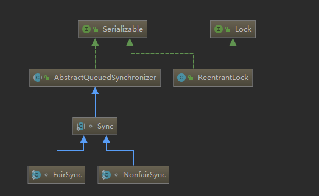

## 常见锁有哪些

- synchronized

- ReentrantLock重入锁

- Semaphore信号量

- ReentrantReadWriteLock读写锁

## ReetrantLock怎么实现
通过持有继承AbstractQueuedSynchronizer的sync实现

ReentrantLock为独占锁，他拥有一个Sync（继承AbstractQueuedSynchronizer）变量，而Sync又有两个实现，分别是FairSync（公平）、NonfairSync（非公平），下面就lock和unlock结合源码分析
### lock
```java
        //NonfairSync中lock实现，ReentrantLock中公平与非公平体现在lock的时候是否会先去CAS一次
        final void lock() {
            //CAS尝试获取资源，FairSync是直接调用acquire
            if (compareAndSetState(0, 1))
                setExclusiveOwnerThread(Thread.currentThread());
            else
                //AQS中实现方法
                acquire(1);
        }
```
AbstractQueuedSynchronizer中方法acquire
```java
    //获取资源
    public final void acquire(int arg) {
        //第一步尝试获取资源，由同步器自己定义
        if (!tryAcquire(arg) &&
            //addWaiter先加入等待队列，再从等待队列中拿线程去获取资源
            acquireQueued(addWaiter(Node.EXCLUSIVE), arg))
            //在等待的队列有可能被调用了中断操作，告知线程调用了中断操作
            selfInterrupt();
    }
```

ReentrantLock->FairSync中方法tryAcquire
```java
        protected final boolean tryAcquire(int acquires) {
            //获取当前线程
            final Thread current = Thread.currentThread();
            //获取资源状态
            int c = getState();
            //状态为0，表明没有线程占有资源
            if (c == 0) {
                //
                if (!hasQueuedPredecessors() &&
                    //CAS设置值
                    compareAndSetState(0, acquires)) {
                    //设置拥有线程为当前线程
                    setExclusiveOwnerThread(current);
                    //返回获取资源成功
                    return true;
                }
            }
            //当前线程为拥有线程
            else if (current == getExclusiveOwnerThread()) {
                //重入锁加上值
                int nextc = c + acquires;
                //检查不是无效的值
                if (nextc < 0)
                    throw new Error("Maximum lock count exceeded");
                //重入锁只有一个线程，直接设置值    
                setState(nextc);
                //返回获取资源成功
                return true;
            }
            //获取资源失败
            return false;
        }
```
AbstractQueuedSynchronizer中方法acquireQueued
```java
    final boolean acquireQueued(final Node node, int arg) {
        //是否取消获取的标志位
        boolean failed = true;
        try {
            //是否有中断
            boolean interrupted = false;
            //循环尝试获取资源
            for (;;) {
                //获取前置节点
                final Node p = node.predecessor();
                //前置节点为头节点并且判断是否获取资源成功
                if (p == head && tryAcquire(arg)) {
                    //获取资源成功后，设置当前节点为头结点，当前线程已获取到资源，不需要在存在等待队列中
                    setHead(node);
                    p.next = null; // help GC
                    //标志位改为false
                    failed = false;
                    //返回是否有中断
                    return interrupted;
                }
                //判断是否应该park
                if (shouldParkAfterFailedAcquire(p, node) &&
                    //park阻塞，并且检查是否有其他线程中断当前线程
                    parkAndCheckInterrupt())
                    //有其他线程对当前线程发起中断
                    interrupted = true;
            }
        } finally {
            //取消
            if (failed)
                //取消获取资源
                cancelAcquire(node);
        }
    }
```

### unlock
ReentrantLock解锁
```java
    public void unlock() {
        //调用AQS的实现类的release
        sync.release(1);
    }
```
AbstractQueuedSynchronizer中方法release
```java
    public final boolean release(int arg) {
        //同步器自己实现的tryRelease
        if (tryRelease(arg)) {
            //从等待队列中拿一个线程unpark
            Node h = head;
            if (h != null && h.waitStatus != 0)
                unparkSuccessor(h);
            return true;
        }
        return false;
    }
```

ReentrantLock->Sync中方法tryRelease
```java
        protected final boolean tryRelease(int releases) {
            //减去release释放的资源，重入锁可以减多次
            int c = getState() - releases;
            //检测当前线程是占有资源线程
            if (Thread.currentThread() != getExclusiveOwnerThread())
                throw new IllegalMonitorStateException();
            //是否已没有线程占有资源    
            boolean free = false;
            //为0时表示没有线程占有资源
            if (c == 0) {
                free = true;
                setExclusiveOwnerThread(null);
            }
            //设置资源值为此次释放后的值
            setState(c);
            return free;
        }
```

### 关键属性

- state：资源情况
- ownerThread：当前持有线程
- Node：等待队列