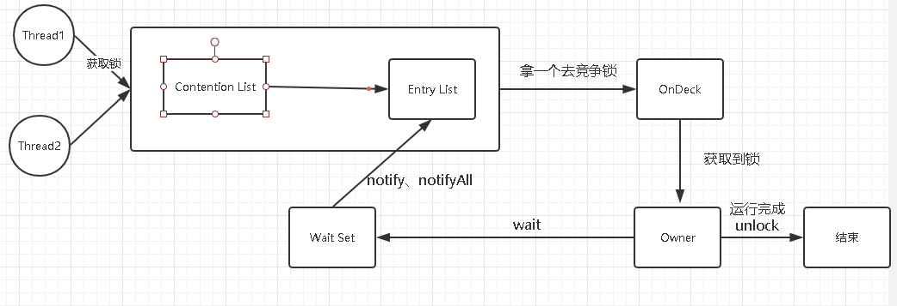

## synchronize实现原理

### 核心组件

1.Wait Set：调用wait方法阻塞的线程放置处
2.Contention List：竞争队列，所有通过synchronized请求锁的线程首先被放置在这里
3.Entry List：Contention List中有资格成为候选资源的移动到Entry List
4.OnDeck：竞争锁资源线程，只能有一个竞争锁线程
5.Owner：已经获取到锁资源的线程

### 实现

1.JVM每次从队列尾部取一个用于OnDeck，但并发情况下Contention List会被大量CAS访问，为了降低对尾部元素竞争，JVM会将一部分线程移到Entry List作为候选竞争线程
2.在Owner unlock时，发现Entry List没有线程，会将Contention List部分线程移到Entry List,并制定Entry List中某个线程为OnDeck
3.处于 ContentionList、EntryList、WaitSet 中的线程都处于阻塞状态
4.Synchronized 是非公平锁。 Synchronized 在线程进入 ContentionList 时，会先尝试自旋获取锁，如果获取不到就进入 ContentionList

## 与Lock相比优缺点分别是

- 优点
  - 不需要关注锁释放，运行完会自动释放锁
- 缺点
  - 没有Lock灵活，不能设置读写锁、不能响应中断
  - 复杂情况下，Lock使用好效率更高

