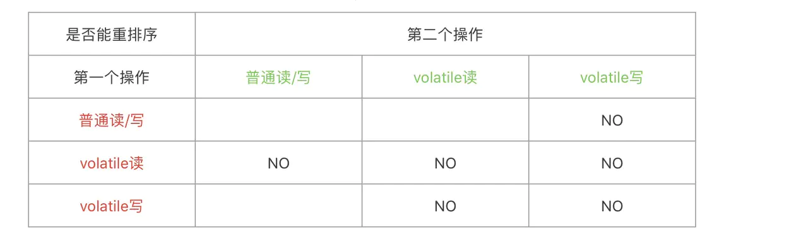

## volatile解决的问题

volatile解决了可见性与有序性问题。

可见性是高速缓存导致的，每个CPU有自己的高速缓存（三级缓存），而线程会有一份主内存复制变量，当两个线程持有同一个变量，会存在一个线程修改了变量，另一个线程看到的值还是之前的情况，因为缓存更新同步时间是不确定的。

有序性是多线程下，代码执行顺序和编写的不一样，称为指令重排。指令重排有两种

- 编译器重排：编译器为了提升执行效率，会在不影响单线程执行结果的情况下对指令重排以让在真实运行时更快。
- CPU重排：CPU重排是因为引入了store buffers导致的，引入store buffers是为了解决MESI（M：modify修改，E：exclusive独占，S：shared共享，I：invalid失效）缓存一致性协议同步缓存时CPU等待问题

### CPU重排示例

```java
public void cpu0(){
    a = 1;
    b = 1;
}

public void cpu1(){
    while(b==1){//true
        assert(a==1);//false
    }
}
```

如上代码所示，会存在b==1而a!=1

- 初始：cpu0有b的缓存0，cpu1有a的缓存0
- 赋值：cpu0对a赋值，写入store buffer，并发送 read invalid；cpu1收到请求，将a放入invalid queue中，发送ack；cpu0对b赋值，因为是独占状态，直接赋值
- 判断：cpu1读取b，发送read，b==1为true；cpu1读取a，此时a失效还在invalid queue中，读取缓存为0，a==1为false

从结果上来看，就像b=1先执行一样，进行了指令重排序

## volatile实现原理

volatile实现原理是通过加内存屏障实现的。

**内存屏障**（英语：Memory barrier），也称**内存栅栏**，**内存栅障**，**屏障指令**等，是一类[同步屏障](https://zh.wikipedia.org/wiki/同步屏障)指令，它使得 CPU 或编译器在对内存进行操作的时候, 严格按照一定的顺序来执行, 也就是说在memory barrier 之前的指令和memory barrier之后的指令不会由于系统优化等原因而导致乱序。

JMM对内存屏障进行了抽象，分为4类LoadLoad、LoadStore、StoreStore、StoreLoad，Load是从主内存读取到缓存，Store从缓存放值到主内存。

volatile写：变量前插入StoreStore，变量后插入StoreLoad

volatile读：变量后插入LoadLoad与LoadStore

变量操作是否允许重排序表如下：



不同的cpu与操作系统有不同的内存屏障命令，而java是支持多平台的，JVM会根据不同平台选择不同的内存屏障指令，JMM提供可见性、有序性的解决方案，即我们常使用volatile、final。

volatile加内存屏障的链路为：volatile->class(filed上有volatile的flag_access_flags)->jvm(看到有access_flags，根据flag与所在平台，选择具体内存屏障指令加上去)