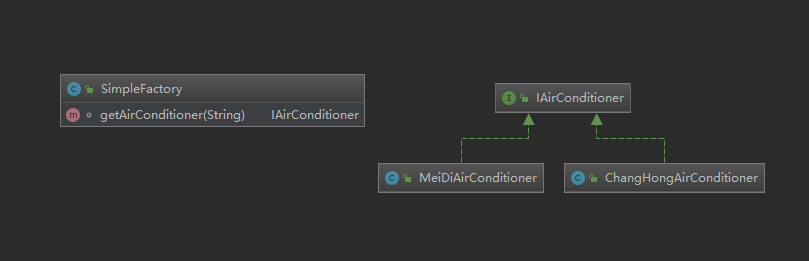
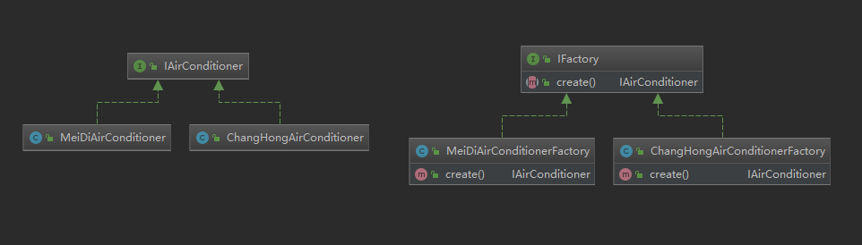
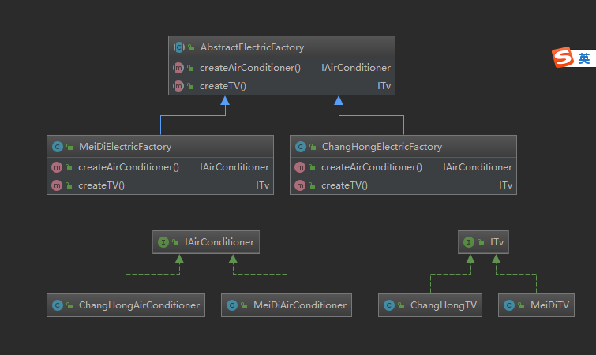

工厂模式是用来创建对象的，当我们创建的对象比较简单时，我们大可以直接new一个；但当创建的对象比较复杂时，或涉及大量重复代码时，就可以使用工厂模式来创建对象了；下面以电器产品为例，看下三种工厂模式的异同
## 简单工厂模式
工厂对象决定创建哪个对象实例，不属于GOF的23种设计模式
```java
public class SimpleFactory {
    /**
     * @param firm 厂商
     * @return 空调产品
     */
    IAirConditioner getAirConditioner(String firm) {
        if ("changhong".equalsIgnoreCase(firm)) {
            return new ChangHongAirConditioner();
        } else if ("meidi".equalsIgnoreCase(firm)) {
            return new MeiDiAirConditioner();
        } else {
            return null;
        }
    }
}
```
当我们想要获得一个空调产品时，我们只需要调用getAirConditioner就能得到产品，而无需关注创建过程，它的类图


- 缺点：不利于扩展，当需要创建的产品变多变复杂，代码会变得臃肿庞大
## 工厂方法模式
定义一个创建对象的接口，让实现接口的子类来创建对象
```java
public interface IFactory {
    IAirConditioner create();
}

public class ChangHongAirConditionerFactory implements IFactory {
    @Override
    public IAirConditioner create() {
        return new ChangHongAirConditioner();
    }
}

public class MeiDiAirConditionerFactory implements IFactory {
    @Override
    public IAirConditioner create() {
        return new MeiDiAirConditioner();
    }
}
```

- 适用于：创建的产品较复杂有差异化，需要扩展
- 缺点：类个数变多，增加了复杂度
## 抽象工厂模式
提供创建一系列相关或相互依赖产品(它们都有一个共有属性，比如这里的电器都是属于同一个厂商)的接口，不指定具体的类
```java
public abstract class AbstractElectricFactory {
    public abstract IAirConditioner createAirConditioner();

    public abstract ITv createTV();
}

public class ChangHongElectricFactory extends AbstractElectricFactory {
    @Override
    public IAirConditioner createAirConditioner() {
        return new  ChangHongAirConditioner();
    }

    @Override
    public ITv createTV() {
        return new ChangHongTV();
    }
}

public class MeiDiElectricFactory extends AbstractElectricFactory {
    @Override
    public IAirConditioner createAirConditioner() {
        return new MeiDiAirConditioner();
    }

    @Override
    public ITv createTV() {
        return new MeiDiTV();
    }
}
```
类图


- 适用于：创建一系列相关或相互依赖的产品
- 缺点：增加复杂度
