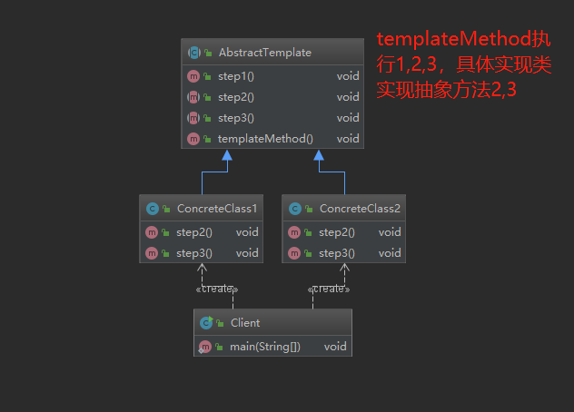

## 定义
- 定义一个操作中的算法的框架，将部分步骤延迟到子类实现，子类可以不改变算法的结构，重新定义该算法的某些特定步骤
  - 钩子方法（Hook Method）：父类定义行为，子类实现，返回值影响公共部分的执行结果
## 应用场景 
- 一次性实现算法不变的部分，将变化的部分留给子类实现
- 多个子类具有相同的方法，并且逻辑大致相同时

## 类图

## 优缺点
- 优点
  - 提取公共部分代码，减少代码重复，提升代码复用
  - 封装不变部分，扩展可变部分，扩展性好，符合开闭原则
- 缺点
  - 类的数量增多
  - 增加复杂度

