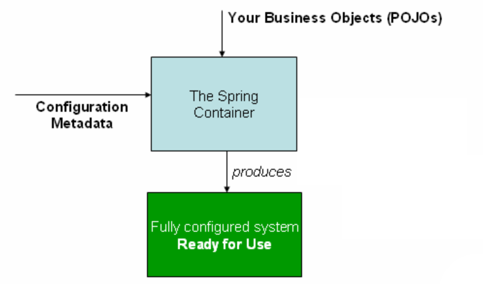
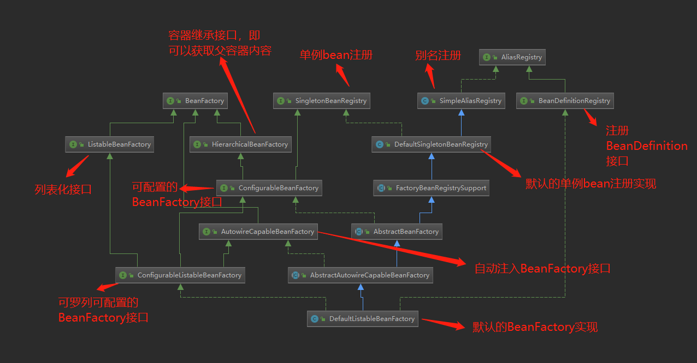
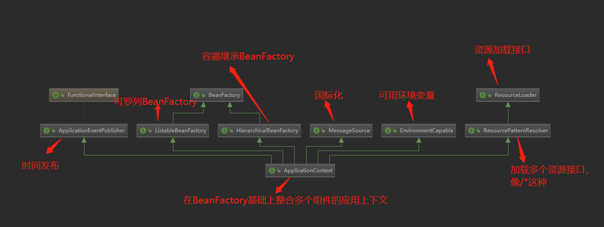
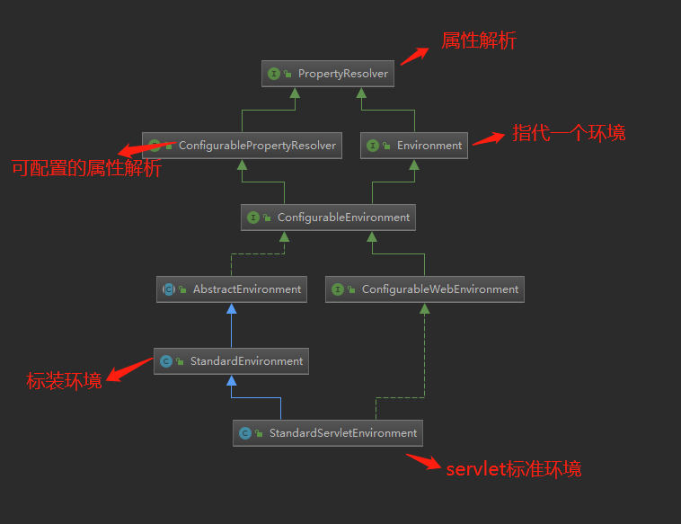
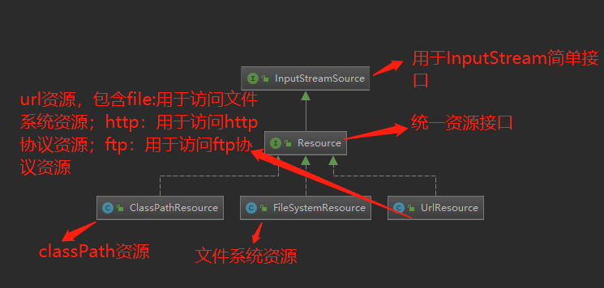
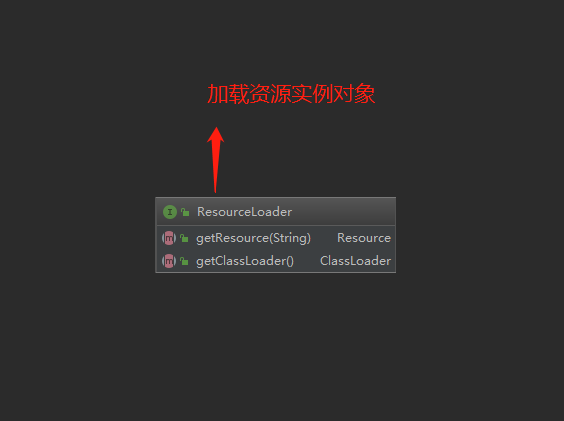
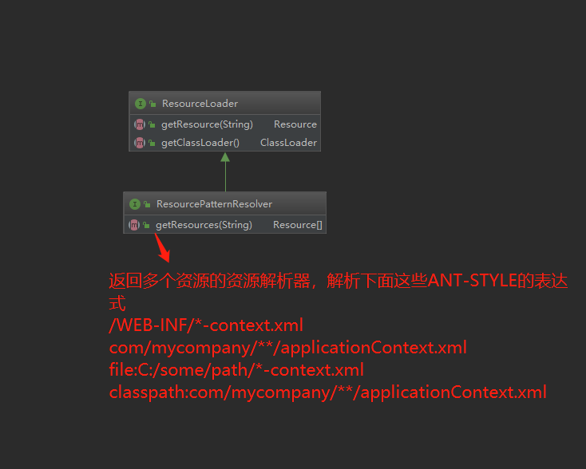
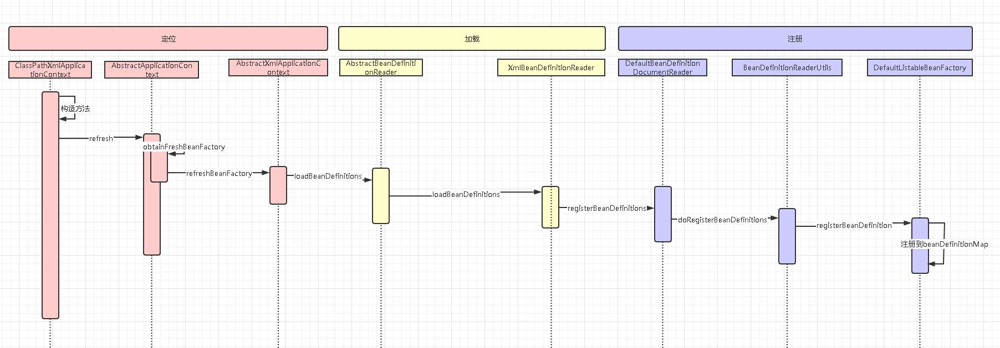
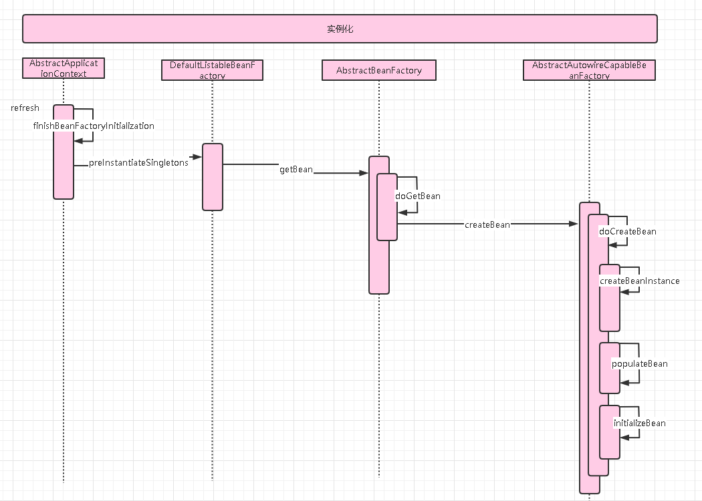

## 容器概述
控制反转（IoC）也称为依赖注入（DI），它是一个过程。对象（Bean）通过构造方法、工厂方法、属性设置依赖项，然后容器在创建对象（Bean）时，注入这些依赖项。此过程从根本上说是通过设置的依赖项去查找对象（Bean）而不是我们主动去设置（因此称为控制翻转）。



## IOC容器
### BeanFactory
- org.springframework.beans中默认实现DefaultListableBeanFactory类图

### ApplicationContext
- 类图

## Environment
- 来看下servlet的环境StandardServletEnvironment类图

- Environment是在初始化时AbstractEnvironment调用钩子方法customizePropertySources把对应环境加进去的，下面我们来看下相应的代码
  - AbstractEnvironment
```java
public abstract class AbstractEnvironment implements ConfigurableEnvironment {
     ......
	/**
	 * Create a new {@code Environment} instance, calling back to
	 * {@link #customizePropertySources(MutablePropertySources)} during construction to
	 * allow subclasses to contribute or manipulate {@link PropertySource} instances as
	 * appropriate.
	 * @see #customizePropertySources(MutablePropertySources)
	 */
	public AbstractEnvironment() {
	    //初始化时，子类添加环境
		customizePropertySources(this.propertySources);
	}
	protected void customizePropertySources(MutablePropertySources propertySources) {
	//空方法，子类需要添加环境时覆盖
	}
	......
}
```
  - StandardEnvironment
```java
public class StandardEnvironment extends AbstractEnvironment {

	/** System environment property source name: {@value}. */
	public static final String SYSTEM_ENVIRONMENT_PROPERTY_SOURCE_NAME = "systemEnvironment";

	/** JVM system properties property source name: {@value}. */
	public static final String SYSTEM_PROPERTIES_PROPERTY_SOURCE_NAME = "systemProperties";


	/**
	 * Customize the set of property sources with those appropriate for any standard
	 * Java environment:
	 * <ul>
	 * <li>{@value #SYSTEM_PROPERTIES_PROPERTY_SOURCE_NAME}
	 * <li>{@value #SYSTEM_ENVIRONMENT_PROPERTY_SOURCE_NAME}
	 * </ul>
	 * <p>Properties present in {@value #SYSTEM_PROPERTIES_PROPERTY_SOURCE_NAME} will
	 * take precedence over those in {@value #SYSTEM_ENVIRONMENT_PROPERTY_SOURCE_NAME}.
	 * @see AbstractEnvironment#customizePropertySources(MutablePropertySources)
	 * @see #getSystemProperties()
	 * @see #getSystemEnvironment()
	 */
	@Override
	protected void customizePropertySources(MutablePropertySources propertySources) {
	    //添加JVM 环境变量，我们平时在idea和tomcat里面写的-D参数
		propertySources.addLast(
				new PropertiesPropertySource(SYSTEM_PROPERTIES_PROPERTY_SOURCE_NAME, getSystemProperties()));
		//电脑的环境变量
		propertySources.addLast(
				new SystemEnvironmentPropertySource(SYSTEM_ENVIRONMENT_PROPERTY_SOURCE_NAME, getSystemEnvironment()));
	}

}
```

  - StandardServletEnvironment
```java
public class StandardServletEnvironment extends StandardEnvironment implements ConfigurableWebEnvironment {
	@Override
	protected void customizePropertySources(MutablePropertySources propertySources) {
	    ......
	    // 添加servletConfigInitParams环境，web.xml里面写的init-param
		propertySources.addLast(new StubPropertySource(SERVLET_CONFIG_PROPERTY_SOURCE_NAME));
		// 添加servletContextInitParams环境，web.xml里面写的context-param
		propertySources.addLast(new StubPropertySource(SERVLET_CONTEXT_PROPERTY_SOURCE_NAME));
		// 添加jndiProperties环境,配置数据库的，一般写在tomcat里面的resource
		if (JndiLocatorDelegate.isDefaultJndiEnvironmentAvailable()) {
			propertySources.addLast(new JndiPropertySource(JNDI_PROPERTY_SOURCE_NAME));
		}
		//调用父类，添加标准环境
		super.customizePropertySources(propertySources);
	}
	......
}
```
## 统一资源加载策略
### Resource
Java自带的java.net.URL类不足以满足所有对低级资源的访问，比如没有标准化的URL实现可用于访问需要从类路径或相对于ServletContext获得的资源。Spring的Resource接口旨在成为一种功能更强大的接口，用于抽象化对低级资源的访问。下面来看下几个常用resource的类图


### ResourceLoader

- 返回多个资源的ResourcePatternResolver

## ApplicationContext分析
## ClassPathXmlApplicationContext时序图
- 加载BeanDefinition时序图

- 实例化时序图

## AbstractApplicationContext的refresh方法
```java
public void refresh() throws BeansException, IllegalStateException {
		synchronized (this.startupShutdownMonitor) {
			// Prepare this context for refreshing.
			// 装备刷新方法，时间、环境、事件这些
			prepareRefresh();

			// Tell the subclass to refresh the internal bean factory.
			// 告诉子类刷新BeanFactory,加载BeanDefinition，获取最新的BeanFactory
			ConfigurableListableBeanFactory beanFactory = obtainFreshBeanFactory();

			// Prepare the bean factory for use in this context.
			// 准备BeanFactory，类加载器、忽略接口、属性解析等
			prepareBeanFactory(beanFactory);

			try {
				// Allows post-processing of the bean factory in context subclasses.
				// 为某些子类预留的BeanFactory后置处理
				postProcessBeanFactory(beanFactory);

				// Invoke factory processors registered as beans in the context.
				// 执行BeanFactoryPostProcessor后置处理
				invokeBeanFactoryPostProcessors(beanFactory);

				// Register bean processors that intercept bean creation.
				// 注册扫描到的BeanPostProcessor到应用上下文
				registerBeanPostProcessors(beanFactory);

				// Initialize message source for this context.
				initMessageSource();

				// Initialize event multicaster for this context.
				initApplicationEventMulticaster();

				// Initialize other special beans in specific context subclasses.
				onRefresh();

				// Check for listener beans and register them.
				registerListeners();

				// Instantiate all remaining (non-lazy-init) singletons.
				// 初始化所有剩余的单例bean
				finishBeanFactoryInitialization(beanFactory);

				// Last step: publish corresponding event.
				finishRefresh();
			}

			catch (BeansException ex) {
				if (logger.isWarnEnabled()) {
					logger.warn("Exception encountered during context initialization - " +
							"cancelling refresh attempt: " + ex);
				}

				// Destroy already created singletons to avoid dangling resources.
				destroyBeans();

				// Reset 'active' flag.
				cancelRefresh(ex);

				// Propagate exception to caller.
				throw ex;
			}

			finally {
				// Reset common introspection caches in Spring's core, since we
				// might not ever need metadata for singleton beans anymore...
				resetCommonCaches();
			}
		}
	}
```

## ApplicationContext扩展点
### FactoryBean

> FactoryBean是实现了org.springframework.beans.factory.FactoryBean<T>接口的Bean,从ApplicationContext的getBean()方法获取的对象不是该类的一个实例，而是该类的getObject()方法所返回的对象。<br>当我们需要获取FactoryBean实例本身而不是它所产生的bean，则要使用'&'符号。<br>当有复杂的初始化场景，比如返回propertySource、mybatis的代理类


### BeanFactoryPostProcess
当BeanFactory加载完成BeanDefinition之后，对BeanDefinition的后置处理
### BeanPostProcess
当对象new出来，在执行init方法之前和之后执行
```java
public interface BeanPostProcessor {
    // init方法之前
	@Nullable
	default Object postProcessBeforeInitialization(Object bean, String beanName) throws BeansException {
		return bean;
	}
	
	// init方式之后
		@Nullable
	default Object postProcessAfterInitialization(Object bean, String beanName) throws BeansException {
		return bean;
	}
}
```

## 参考

- [详解Spring IOC](https://www.jianshu.com/p/b60c30fdcc65)
- [Spring 框架的设计理念与设计模式分析](https://developer.ibm.com/zh/articles/j-lo-spring-principle/)
-  [Spring 官方文档](https://docs.spring.io/spring/docs/current/spring-framework-reference/core.html#beans)