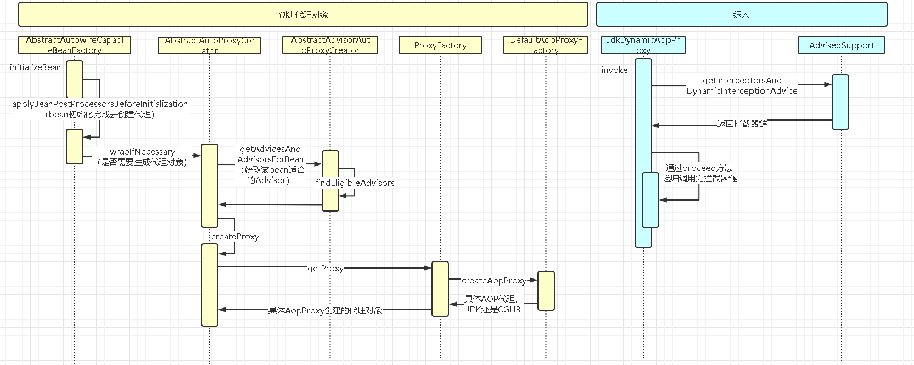

## 核心概念
- 连接点（JoinPoint）：程序执行过程中某个特定的点，比如某方法调用的时候或者处理异常的时候。在Spring AOP中，连接点都是方法级别；在AspectJ中连接点还可以是构造器、字段。
- **通知（Advice）**：在特定的连接点上执行的操作。对功能的增强处理。
- **切入点（Pointcut）**：匹配连接点的断言。通知和一个切入点表达式关联，并在满足这个切入点表达式的连接点上运行。Spring AOP缺省使用AspectJ切入点语法，但没哟支持所有的AspectJ语法，比如针对字段与构造函数的切入点语法。
- 切面（Aspect）：关注点的模块化，通知和切入点的结合。
- 目标对象（Target Object）：被一个或多个切面通知的对象。Spring AOP中是被代理对象，属于IOC管理对象。
- AOP代理（AOP Proxy）：AOP框架创建的对象。
- 引入（Introduction）：用来给一个类型声明额外的方法或属性（也被称为连接类型声明）。Spring允许引入新的接口（以及一个对应的实现）到任何被代理的对象。例如，你可以使用引入来使一个bean实现IsModified接口，以便简化缓存机制。
- 织入（Weaving）：把切面连接到其他应用程序类型或对象上，创建代理对象。

### 通知类型
- 前置通知（Before advice）：在某连接点之前执行的通知。
- 后置通知（After returning advice）：在某连接点正常完成之后的通知。
- 异常通知（After throwing advice）：在方法抛出异常退出时执行的通知。
- 最终通知（After(finally) advice）：在某连接点退出的时候执行的通知。
- 环绕通知（Around advice）：包围一个连接点的通知。

### 织入方式
- 编译时：AspectJ编译器
- 类加载时：特殊的类加载器，如Spring的LoadTimeWeaver
- 运行时：Spring AOP

## 运行时序图

## 简诉
AOP是运行时织入，即在Spring启动时，通过判断切入点，为适合的类和方法加入声明的通知，切入点即匹配的断言，通俗点就是那些类那些方法要添加通知，通知即我们要增强的方法，可以前后、异常、finally、围绕。生成代理的方式一般分为JDK动态代理和cglib代理。