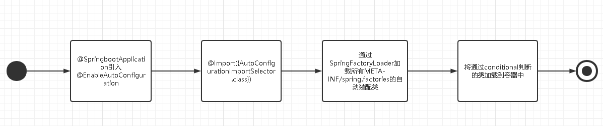

## SpringBoot是什么

- 约定优于配置理念下的产物，简化Spring使用难度，简省配置，快速高效使用Spring框架开发应用
### 约定优于配置
约定是一种规范，即大家定好某某东西默认应该是怎么样的，以达到简化配置的作用，当不配置时，使用约定好的值
### 快速高效，以SpringMVC为例子
- 不使用SpringBoot
  - 创建一个项目
  - 添加依赖
  - 配置web.xml,DispatchServlet，componentScan
  - 写Controller业务代码
  - 发布到Servlet容器
- 使用SpringBoot
  - 创建项目
  - 写Controller业务代码

## SpringBoot 四大特性

- 自动装配 AutoConfiguration
- 启动依赖 Starter
- 运行监控 Actuator
- 命令行 CLI

## Spring注解驱动的发展
### 1.x
此时Java5刚出来，兴起了使用Annotation的技术风。但此时Spring装载Bean还是xml
\<bean id="" class=""/\>

### 2.x 
提供了大量注解
- @Component、@Service组件声明
- @Controller、@RequestMapping等SpringMVC的注解
- @Autowired、@Qualifier依赖注入等等


此时还没有完全去xml化，还需要xml配置像component-scan<br>
相对1.x减少xml配置

### 3.x
注解驱动的里程碑，功能特性有非常大的扩展
- @Configuration 完全的去xml化
- @ComponentScan 配置扫描路径
- @Import 导入配置类
- @Enablexxx 模块化装载

### 4.x
@Conditional 条件完成Bean初始化

### 5.x
@Indexed 索引，提升componentScan的性能

## Spring的动态装配（动态的装配）
- ImportSelector
- ImportBeanDefinitionRegistrar

## SPI 
最早来源于Java Service Loader 称为service provider interface，为接口提供实现。Spring进行扩展SpringFactoriesLoader：会拿到所有META-INF/spring.factories所配置的接口与实现
- 写在classpath下的META-INF/spring.factories
- 配置对应的key-value 比如自动装载的 org.springframework.boot.autoconfigure.EnableAutoConfiguration=你的自动装载类

## 自动装配
由@EnableAutoConfiguration开始，开启自动装配
```
@Target({ElementType.TYPE})
@Retention(RetentionPolicy.RUNTIME)
@Documented
@Inherited
@AutoConfigurationPackage
@Import({AutoConfigurationImportSelector.class})//运用Spring的动态装载，加载自动装配类
public @interface EnableAutoConfiguration {
    String ENABLED_OVERRIDE_PROPERTY = "spring.boot.enableautoconfiguration";

    Class<?>[] exclude() default {};

    String[] excludeName() default {};
}
```


