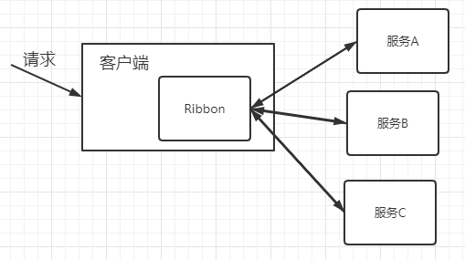
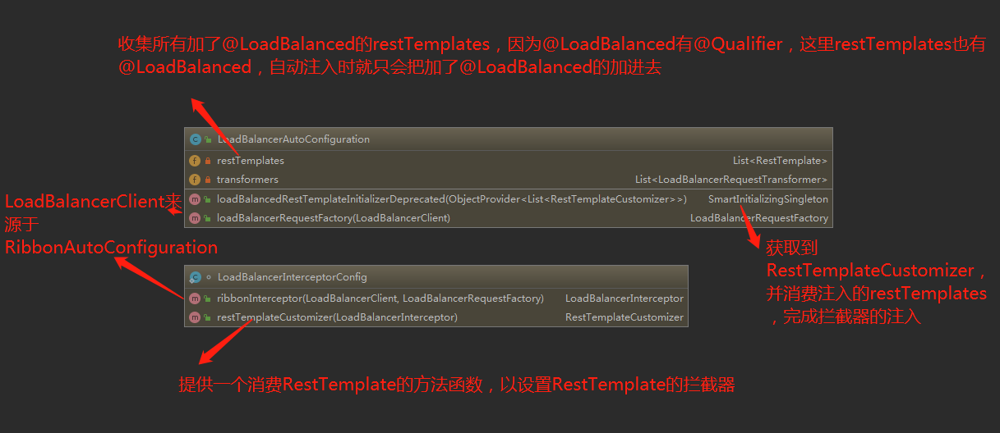
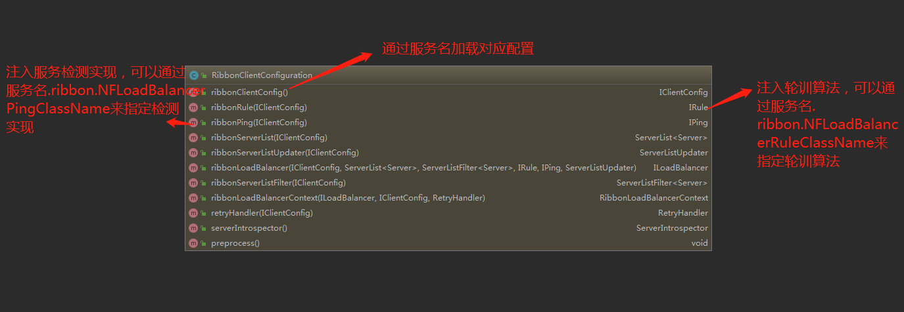
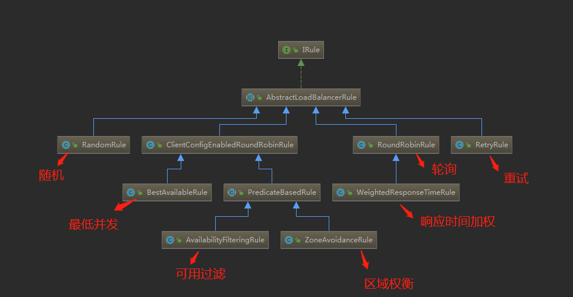

## 了解Ribbo--什么是Ribbon

`Ribbon`是`Netflix`公司开源的一个负载均衡的项目。

## 增进理解--确定RIbbon关键质量

负载均衡项目简单来说就是把客户端的请求分发给不同的服务器，如下图



在这个过程中最重要的三个功能就是

- 怎样拦截客户端请求

- 配置要接受请求的服务器地址
- 不同的轮训算法转发请求

## 全面解析--使用与原理

### 基础使用

- 添加引用

  ```java
  <dependency>
        <groupId>org.springframework.cloud</groupId>
        <artifactId>spring-cloud-starter-netflix-ribbon</artifactId>
      </dependency>
  ```
- 添加服务列表
  ```java
  say-hello:
      ribbon:
        eureka:
          enabled: false
        listOfServers: localhost:8090,localhost:9092,localhost:9999
        ServerListRefreshInterval: 15000
  ```
- 添加负载均衡
  ```java
  @LoadBalanced
  @Bean
  RestTemplate restTemplate(){
	return new RestTemplate();
  }
  ```

### 怎样拦截客户端请求详解

### 配置要接受请求的服务器地址详解

### 不同的轮训算法转发请求详解
