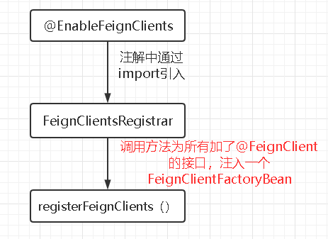

## OpenFeign概述
`OpenFeign`是`Spring Cloud` 二级子项目，平时说的`Feign`指的是Netflix下的Feign。

`OpenFeign`是一种声明式服务调用。声明式调用是指，就像调用本地方法一样调用远程方法，无需感知操作远程`http`请求。
## 功能分析
要达到声明式服务调用的效果，`OpenFeign`需要做到给每一个`@FeignClient`注解的接口生成代理，注入到容器中，并且代理能根据接口方法信息完成调用远程方法。根据这两个功能可以把`OpenFeign`生效过程拆分成三部分
- 配置Client 
- 注入Client代理对象
- 远程调用
## @EnableFeignClients详解

`@EnableFeignClients`通过如上流程为每一个`@FeignClient`注解的接口注入了一个`FeignClientFactoryBean`，当获取实例的时候，从`FeignClientFactoryBean.getObject`获取对应实例

## FeignClientFactoryBean生成FeignClient代理实例流程

## FeignClient调用过程

