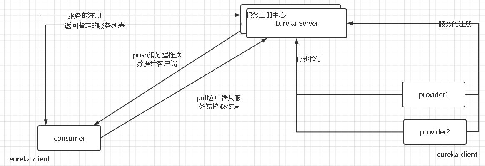

## 面临问题

在分布式系统中，服务之间的调用地址如果是配置在客户端，面临两个问题

- 服务上线与下线的动态感知
- 服务调用者地址的维护将非常困难

这个时候我们就需要一个注册中心去统一的管理这个事情，注册中心需要`高可用`。因为如果不是`高可用`，当注册中心挂了的时候，所有服务之间的通信就出问题了。


## 注册中心Eureka分析
补
`eureka`分为服务端和客户端，服务端和客户端之间的功能主要可以分为三部分
- 服务注册
- 服务的上线与下线-续约
- 同步

## 服务注册
服务注册由客户端调用服务端接口进行注册
### 客户端
当Spring容器加载完所有的Bean并且初始化之后，会继续回调实现了`SmartLifeCycle`接口的类中对应的方法。`EurekaAutoServiceRegistration`实现了`SmartLifeCycle`，调用链路为EurekaAutoServiceRegistration.start->EurekaServiceRegistry.register，在`register`方法中，设置了状态（状态变更会发布事件，被监听从而做出相应响应）与健康检查，没有真正的调用注册。
```java
	@Override
	public void register(EurekaRegistration reg) {
		maybeInitializeClient(reg);

		if (log.isInfoEnabled()) {
			log.info("Registering application "
					+ reg.getApplicationInfoManager().getInfo().getAppName()
					+ " with eureka with status "
					+ reg.getInstanceConfig().getInitialStatus());
		}

		reg.getApplicationInfoManager()
				.setInstanceStatus(reg.getInstanceConfig().getInitialStatus());

		reg.getHealthCheckHandler().ifAvailable(healthCheckHandler -> reg
				.getEurekaClient().registerHealthCheck(healthCheckHandler));
	}
```
`EurekaAutoServiceRegistration`与`EurekaServiceRegistry`是通过`EurekaClientAutoConfiguration`、`EurekaClientConfiguration`注入的，而在注入`CloudEurekaClient`时，会通过构造函数，最终调用到`DiscoveryClient`的构造函数里，在这个方法里，初始了很多定时任务。
```java
DiscoveryClient(ApplicationInfoManager applicationInfoManager, EurekaClientConfig config, AbstractDiscoveryClientOptionalArgs args,
                    Provider<BackupRegistry> backupRegistryProvider, EndpointRandomizer endpointRandomizer) {
......
            // default size of 2 - 1 each for heartbeat and cacheRefresh
            // 初始化线程池
            scheduler = Executors.newScheduledThreadPool(2,
                    new ThreadFactoryBuilder()
                            .setNameFormat("DiscoveryClient-%d")
                            .setDaemon(true)
                            .build());
            // 初始化心跳检测线程池
            heartbeatExecutor = new ThreadPoolExecutor(
                    1, clientConfig.getHeartbeatExecutorThreadPoolSize(), 0, TimeUnit.SECONDS,
                    new SynchronousQueue<Runnable>(),
                    new ThreadFactoryBuilder()
                            .setNameFormat("DiscoveryClient-HeartbeatExecutor-%d")
                            .setDaemon(true)
                            .build()
            );  // use direct handoff

           // 初始化刷新线程池
            cacheRefreshExecutor = new ThreadPoolExecutor(
                    1, clientConfig.getCacheRefreshExecutorThreadPoolSize(), 0, TimeUnit.SECONDS,
                    new SynchronousQueue<Runnable>(),
                    new ThreadFactoryBuilder()
                            .setNameFormat("DiscoveryClient-CacheRefreshExecutor-%d")
                            .setDaemon(true)
                            .build()
            );  // use direct handoff

            eurekaTransport = new EurekaTransport();
            scheduleServerEndpointTask(eurekaTransport, args);

            AzToRegionMapper azToRegionMapper;
            if (clientConfig.shouldUseDnsForFetchingServiceUrls()) {
                azToRegionMapper = new DNSBasedAzToRegionMapper(clientConfig);
            } else {
                azToRegionMapper = new PropertyBasedAzToRegionMapper(clientConfig);
            }
            if (null != remoteRegionsToFetch.get()) {
                azToRegionMapper.setRegionsToFetch(remoteRegionsToFetch.get().split(","));
            }
            instanceRegionChecker = new InstanceRegionChecker(azToRegionMapper, clientConfig.getRegion());
        } catch (Throwable e) {
            throw new RuntimeException("Failed to initialize DiscoveryClient!", e);
        }

        if (clientConfig.shouldFetchRegistry() && !fetchRegistry(false)) {
            fetchRegistryFromBackup();
        }

        // call and execute the pre registration handler before all background tasks (inc registration) is started
        if (this.preRegistrationHandler != null) {
            this.preRegistrationHandler.beforeRegistration();
        }

        if (clientConfig.shouldRegisterWithEureka() && clientConfig.shouldEnforceRegistrationAtInit()) {
            try {
                // 第一次注册
                if (!register() ) {
                    throw new IllegalStateException("Registration error at startup. Invalid server response.");
                }
            } catch (Throwable th) {
                logger.error("Registration error at startup: {}", th.getMessage());
                throw new IllegalStateException(th);
            }
        }

        // finally, init the schedule tasks (e.g. cluster resolvers, heartbeat, instanceInfo replicator, fetch
        // 初始化定时任务
        initScheduledTasks();
......        
}
```
所以在客户端，第一次注册是在初始化CloudEurekaClient初始化时完成，后续会有一个每隔40s的定时任务，判断当实例状态发生改变时进行注册。
### 服务端
服务端接受注册请求的接口在`ApplicationResource`中，注册调用链路为ApplicationResource.addInstance->AbstractInstanceRegistry.register->PeerAwareInstanceRegistryImpl.register。
#### Eureka的三级缓存
设计三级缓存的意义是避免高并发场景下，因为锁的竞争，导致性能问题。三级缓存分别是registry，readWriteCacheMap，readOnlyCacheMap。
服务注册时存入registry，默认情况下定时任务每30s将readWriteCacheMap同步至readOnlyCacheMap，每60s清理超过90s未续约的节点。
Eureka Client每30s从readOnlyCacheMap更新服务注册信息，当readOnlyCacheMap没有时，会从readWriteCacheMap中获取，如果readWriteCacheMap也没有就返回null。

## 服务的上线与下线-续约
前面注册讲了EurekaClient在DiscoveryClient的构造函数中会初始化心跳检测的定时任务。在这个定时任务中，最终执行`HeartbeatThread.renew`进行续约，超过90秒没续约的就会被服务端干掉。
## 同步
### 客户端--服务端
同样的在DiscoveryClient的构造函数中会去第一次拉取服务地址信息，后续会有定时任务每隔30秒去拉取一次，拉取代码为`TimedSupervisorTask.run`，值得注意的是，这个定时任务有个设定，一旦遇到超时就会将下一个周期的间隔时间调大，如果连续超时，那么每次间隔时间都会增大一倍，一直到达外部参数设定的上限为止，一旦新任务不再超时，间隔时间又会自动恢复为初始值。避免了网络问题时，无用的调用。

### 服务端--服务端
服务端之间同步比较简单，当`eureka client`注册时，服务端会获取所有`eureka server`节点，全部调用一次注册。


## Eureka的自我保护
Eureka Server在运行期间会去统计心跳失败的比例在15分钟之内是否低于85% , 如果低于85%，
Eureka Server会认为当前实例的客户端与自己的心跳连接出现了网络故障，那么Eureka Server会把这些实例保护起来，让这些实例不会过期导致实例剔除。
这样做的目的是为了减少网络不稳定或者网络分区的情况下，Eureka Server将健康服务剔除下线的问题。 使用自我保护机制可以使得Eureka 集群更加健壮和稳定的运行。