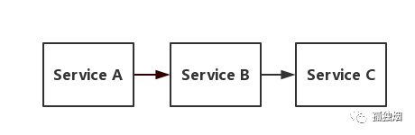
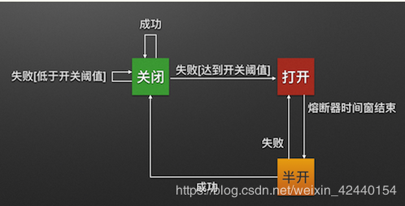
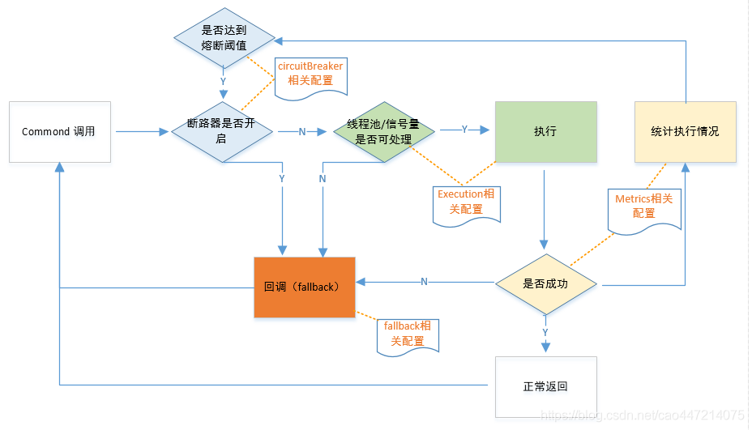
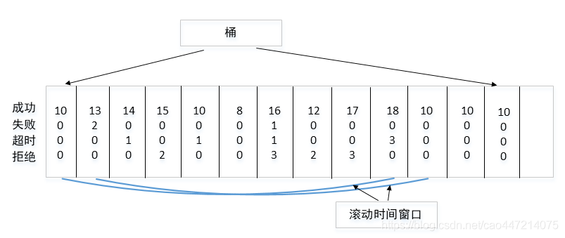

## 简述
`hystrix`是Netlifx开源的一款容错框架，防雪崩利器，具备服务降级，服务熔断，依赖隔离，监控(Hystrix Dashboard)等功能。

有这样的服务调用链路A->B->C，如果Service C因为抗不住请求，变得不可用。那么Service B的请求也会阻塞，慢慢耗尽Service B的线程资源，Service B就会变得不可用。紧接着，Service A也会不可用，一个服务失败，导致整条链路的服务都失败的情形，我们称之为服务雪崩
## Hystrix三种状态

- 关闭：请求正常，不使用熔断器。
- 打开：请求被降级处理；延时一段时候后（默认休眠时间是5S）会进入halfopen状态；默认失败比例阀值是50%，请求次数最少不低于20次，例如：一段时间内请求30次，有20失败，熔断器将会打开，默认5s内的请求都会失败，直接返回。
- 半开：在进入该状态后会放入部分请求；判断请求是否成功，不成功，进入open状态，重新计时，进入halfopen状态；成功，进入closed状态。
## Hystrix降级的三种方式
`hystrix`降级的默认配置都在HystrixCommandProperties.java中，并且在这个类里面加载全局配置，`hystrix`实现是使用AOP生成代理类实现，执行流程如下。

### 熔断触发降级
```java
@HystrixCommand(commandProperties = {
            @HystrixProperty(name="circuitBreaker.enabled",value ="true"),
            @HystrixProperty(name="circuitBreaker.requestVolumeThreshold",value = "5"),
            @HystrixProperty(name="circuitBreaker.sleepWindowInMilliseconds",value = "5000"),
            @HystrixProperty(name="circuitBreaker.errorThresholdPercentage",value = "50")
    },fallbackMethod = "fallback",
    groupKey = "",threadPoolKey = "order-service")
    @GetMapping("/hystrix/order/{num}")
    public String queryOrder(@PathVariable("num")int num){
        if(num%2==0){
            return "正常访问";
        }
        //restTemplate默认有一个请求超时时间
        return  restTemplate.getForObject("http://localhost:8082/orders",String.class);
    }
    public String fallback(int num){
        return "";
    }
```
触发降级统计成功失败比例，使用的是滑动窗口，尽量避免临界值的影响。
- 临界值：要求是1分钟100个请求，在这1分钟的最后一秒发了99个请求，下一分钟的第一秒也发了99个请求，这样没有触发熔断，但是是不合理的。
- 滑动窗口：将统计时间等分，依次滑动，统计窗格里面的成功失败数目、比例。

### 超时触发降级
```java
    @HystrixCommand(fallbackMethod ="timeoutFallback",commandProperties = {
            @HystrixProperty(name="execution.isolation.thread.timeoutInMilliseconds",value = "3000"),
    })
    @GetMapping("/hystrix/timeout")
    public String queryOrderTimeout(){
        return  restTemplate.getForObject("http://localhost:8082/orders",String.class);
    }
```
### 资源隔离触发降级
`hystrix`中的资源隔离有两种方式`线程池`与`信号量`。
```java
@HystrixCommand(fallbackMethod = "semaphoreQuarantineFallback",commandProperties = {
            @HystrixProperty(name = HystrixPropertiesManager.EXECUTION_ISOLATION_STRATEGY,value = "SEMAPHORE")// 信号量隔离
            @HystrixProperty(name = HystrixPropertiesManager.EXECUTION_ISOLATION_SEMAPHORE_MAX_CONCURRENT_REQUESTS,value = "300")//信号量最大并发数
    })
    
    
    //线程池隔离注解
    @HystrixCommand(groupKey = "service1", commandKey = "key1", threadPoolKey = "method1", fallbackMethod = "fallBack", threadPoolProperties = {
            @HystrixProperty(name = "coreSize", value = "3") })
```
## Hystrix与Feign结合
在yml中添加配合
```java
feign:
  hystrix:
    enabled: true
hystrix:
  command:
    default:  #全局配置， feignclient#method(param)
      execution:
        timeout:
          enable: true
        isolation:
          thread:
            timeoutInMilliseconds: 1000
    OrderServiceFeignClient#orders():
      execution:
        isolation:
          strategy: SEMAPHORE
          semaphore:
            maxConcurrentRequests: 10
    OrderServiceFeignClient#insert():
      execution:
        isolation:
          strategy: THREAD
  threadpool:
    order-service:
      coreSize: 2
      maxQueueSize: 1000
      queueSizeRejectionThreshold:  800
```
## Hystrix相关配置
- Execution相关的属性的配置

  - hystrix.command.default.execution.isolation.strategy 隔离策略，默认是 Thread, 可选Thread｜Semaphore
  - hystrix.command.default.execution.isolation.thread.timeoutInMilliseconds 命令执行超时时间，默认1000ms
  - hystrix.command.default.execution.timeout.enabled 执行是否启用超时，默认启用true
  - hystrix.command.default.execution.isolation.thread.interruptOnTimeout 发生超时时是否中断，默认true
  - hystrix.command.default.execution.isolation.semaphore.maxConcurrentRequests 最大并发请求数，默认10，该参数当使用 ExecutionIsolationStrategy.SEMAPHORE策略时才有效。如果达到最大并发请求数，请求会被拒绝。理论上选择semaphore size的原则和选择thread size一致，但选用semaphore时每次执行的单元要比较小且执行速度快（ms级别），否则的话该semaphore应该占整个容器（tomcat）的线程池的一小部分。

- Fallback相关的属性
  - hystrix.command.default.fallback.isolation.semaphore.maxConcurrentRequests 如果并发数达到该设置值，请求会被拒绝和抛出异常并且fallback不会被调用。默认10
  - hystrix.command.default.fallback.enabled 当执行失败或者请求被拒绝，是否会尝试调用 hystrixCommand.getFallback() 。默认true

- Circuit Breaker相关的属性

  - hystrix.command.default.circuitBreaker.enabled 用来跟踪circuit的健康性，如果未达标则让request短路。默认true
  - hystrix.command.default.circuitBreaker.requestVolumeThreshold 一个 rolling window内最小的请求数。如果设为20，那么当一个rolling window的时间内（比如说1个rolling window是10秒）收到19个请求，即使19个请求都失败，也不会触发circuit break。默认20
  - hystrix.command.default.circuitBreaker.sleepWindowInMilliseconds 触发短路的时间值，当该值设为5000时，则当触发circuit break后的5000毫秒内都会拒绝 request，也就是5000毫秒后才会关闭circuit。默认5000
  - hystrix.command.default.circuitBreaker.errorThresholdPercentage错误比率阀值，如果错误率>=该值，circuit会被打开，并短路所有请求触发fallback。默认50
  - hystrix.command.default.circuitBreaker.forceOpen 强制打开熔断器，如果打开这个开关，那么拒绝所有request，默认false
  - hystrix.command.default.circuitBreaker.forceClosed 强制关闭熔断器，如果这个开关打开，circuit将一直关闭且忽略circuitBreaker.errorThresholdPercentage。

- Metrics相关参数

  - hystrix.command.default.metrics.rollingStats.timeInMilliseconds 设置统计的时间窗口值的毫秒值，circuit break 的打开会根据1个rolling window的统计来计算。若rolling window被设为10000毫秒，则rolling window会被分成n个 buckets，每个bucket包含success，failure，timeout，rejection的次数的统计信息。默认10000
  - hystrix.command.default.metrics.rollingStats.numBuckets 设置一个rolling window被划分的数量，若numBuckets＝10，rolling window＝10000，那么一个 bucket的时间即1秒。必须符合rolling window% numberBuckets == 0。默认10
  - hystrix.command.default.metrics.rollingPercentile.enabled 执行时是否 enable指标的计算和跟踪，默认true
  - hystrix.command.default.metrics.rollingPercentile.timeInMilliseconds 设置 rolling percentile window的时间，默认60000
  - hystrix.command.default.metrics.rollingPercentile.numBuckets 设置rolling percentile window的numberBuckets。逻辑同上。默认6
  - hystrix.command.default.metrics.rollingPercentile.bucketSize 如果bucket size＝100，window＝10s，若这10s里有500次执行，只有最后100次执行会被统计到bucket里去。增加该值会增加内存开销以及排序的开销。默认100
  - hystrix.command.default.metrics.healthSnapshot.intervalInMilliseconds 记录health快照（用来统计成功和错误率）的间隔，默认500ms

- Request Context 相关参数

  - hystrix.command.default.requestCache.enabled 默认true，需要重载 getCacheKey()，返回null时不缓存
  - hystrix.command.default.requestLog.enabled 记录日志到 HystrixRequestLog，默认true

- Collapser Properties 相关参数

  - hystrix.collapser.default.maxRequestsInBatch 单次批处理的最大请求数，达到该数量触发批处理，默认Integer.MAX_VALUE
  - hystrix.collapser.default.timerDelayInMilliseconds 触发批处理的延迟，也可以为创建批处理的时间＋该值，默认10
  - hystrix.collapser.default.requestCache.enabled 是否对 HystrixCollapser.execute() and HystrixCollapser.queue()的cache存储，默认true

- ThreadPool 相关参数：线程数默认值10，适用于大部分情况（有时可以设置得更小），如果需要设置得更大，那有个基本的公式可以follow：requests per second at peak when healthy × 99th percentile latency in seconds + somebreathing room 每秒最大支撑的请求数 (99%平均响应时间 + 缓存值) 比如：每秒能处理1000个请求，99%的请求响应时间是60ms，那么公式是： 1000（0.060+0.012）基本的原则是保持线程池尽可能小，主要是为了释放压力，防止资源被阻 塞。当一切都是正常的时候，线程池一般仅会有1到2个线程激活来提供服务。
  - hystrix.threadpool.default.coreSize 并发执行的最大线程数，默认10
  - hystrix.threadpool.default.maxQueueSize BlockingQueue的最大队列数，当设为－1，会使用 SynchronousQueue，值为正时使用LinkedBlcokingQueue。该设置只会在初始化时有效，之后不能修改threadpool的queue size，除非reinitialising thread executor。默认－1。   
  - hystrix.threadpool.default.queueSizeRejectionThreshold 即使maxQueueSize 没有达到，达到 queueSizeRejectionThreshold该值后，请求也会被拒绝。因为maxQueueSize不能被动态修改， 这个参数将允许我们动态设置该值。if maxQueueSize == 1，该字段将不起作用
  - hystrix.threadpool.default.keepAliveTimeMinutes 如果corePoolSize和 maxPoolSize设成一样（默认实现）该设置无效。如果通过 plugin（https://github.com/Netflix/Hystrix/wiki/Plugins）使用自定义实现，该设置才有用，默认1
  - hystrix.threadpool.default.metrics.rollingStats.timeInMilliseconds 线程池统计指标的时间，默认10000
  - hystrix.threadpool.default.metrics.rollingStats.numBuckets 将rolling window划分为n个buckets，默认10

## 参考

[spring cloud hystrix 熔断详解](https://www.huaweicloud.com/articles/c61b94f240d19f254a89f06b2f018c4e.html)

[Hystrix详解](https://blog.csdn.net/weixin_42440154/article/details/105428454)

[咕泡学院](https://www.gupaoedu.cn/)

