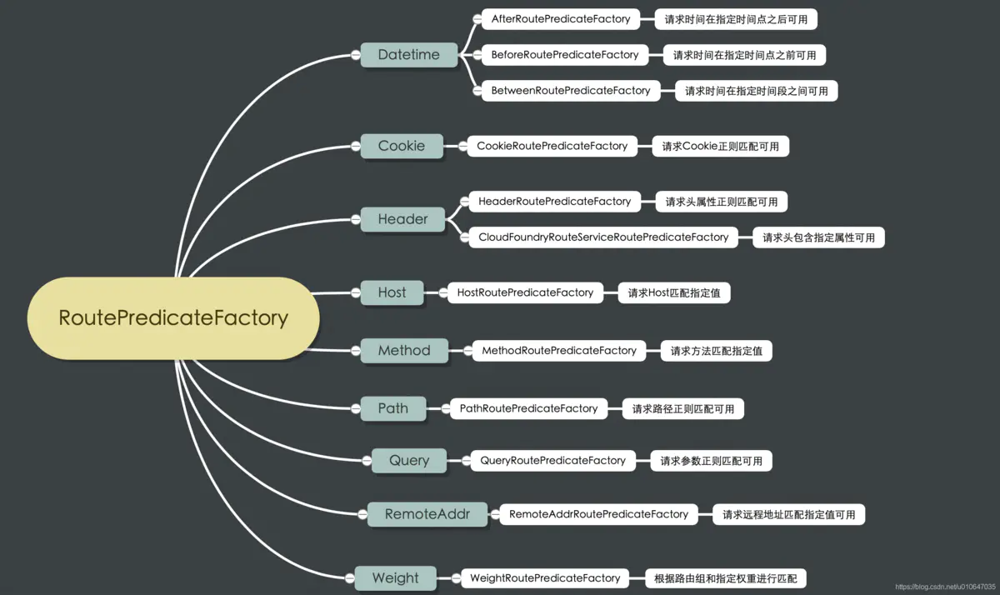
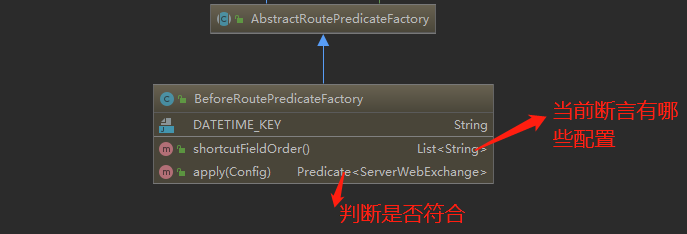
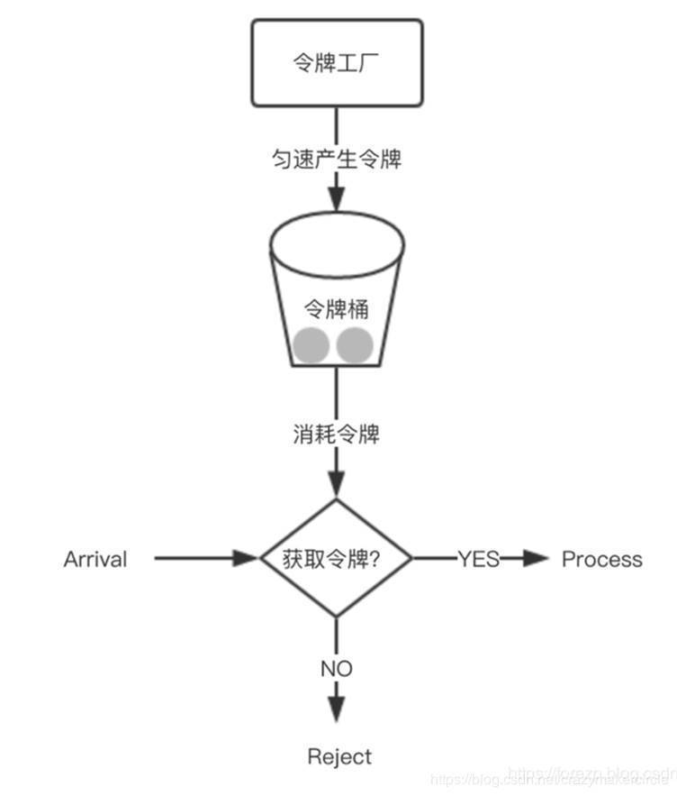

## 简述
单体应用拆分成多个服务后，对外需要一个统一入口，解耦客户端与内部服务。
`SpringCloud Gateway` 是 Spring Cloud 的一个全新项目，该项目是基于 Spring 5.0，Spring Boot 2.0 和 Project Reactor 等技术开发的网关，它旨在为微服务架构提供一种简单有效的统一的 API 路由管理方式。
`Spring Cloud Gateway` 的目标，不仅提供统一的路由方式，并且基于 Filter 链的方式提供了网关基本的功能，例如：安全，监控/指标，和限流。
## Spring Cloud Gateway的核心概念


### Route 路由
它是网关的基础元素，包含ID、目标URI、断言、过滤器组成，当前请求到达网关时，会通过Gateway Handler Mapping，基于断言进行路由匹配，当断言为true时，匹配到路由进行转发。
```java
spring:
  cloud:
    gateway:
      routes:// -表明是数组，可配置多个
        - id: order_route //ID
          uri: lb://serviceName //目标URI,lb表示负载均衡，serviceName为注册在注册中心上的名称
          predicates://断言
            - Path=/path1
          filters://过滤器
            - StripPrefix=1
```
### Predicate断言
匹配HTTP请求中的元素，一旦匹配为true，则表示匹配到合适的路由进行转发。常用断言如下：

可以添加自定义断言，继承AbstractRoutePredicateFactory，命名规则为`断言名称RoutePredicateFactory`，以`BeforeRoutePredicateFactory`为例：

配置的时候只需要将RoutePredicateFactory前面的配置在predicates就可以了。
### Filter过滤器
Filter分为GlobalFilter与RouteFilter，同时,Filter中pre过滤逻辑在目标请求之前执行，post过滤逻辑在目标请求之后执行，如下：
```java
    @Override
    public GatewayFilter apply(GpConfig config) {
        //Filter pre  post
        return ((exchange,chain)->{
            // 这里写逻辑就是pre过滤逻辑
            return chain.filter(exchange).then(Mono.fromRunnable(()->{
                // 这里写逻辑，就是post过滤逻辑
            }));
        });
    }
```
#### GlobalFilter
自定义全局过滤器，只需要继承`GlobalFilter`。
#### RouteFilter
与`Predicate`相似，自定义RouteFilter只需要继承`AbstractGatewayFilterFactory`，命名规则为`过滤器名称GatewayFilterFactory`，官方定义的Filter在包`org.springframework.cloud.gateway.filter.factory`下，这里就不在赘述，单独只讲下`RequestRateLimiterGatewayFilterFactory`限流过滤器
```java
spring:
  cloud:
    gateway:
      routes:
      - id: limit_route
        uri: http://localhost
        predicates:
        - After=2017-01-20T17:42:47.789-07:00[America/Denver]
        filters:
        - name: RequestRateLimiter
          args:
            key-resolver: '#{@userKeyResolver}'
            redis-rate-limiter.replenishRate: 1 //令牌桶中令牌的填充速度，代表允许每秒执行的请求数。
            redis-rate-limiter.burstCapacity: 3 //令牌桶的容量，也就是令牌桶最多能够容纳的令牌数。表示每秒用户最大能够执
行的请求数量。
  application:
    name: cloud-gateway
  redis:
    host: localhost
    port: 6379
```
RequestRateLimiter，采用的是令牌桶算法，匀速产生令牌，令牌桶中存储令牌，达到最大值时，不再增加，每个请求消耗一个令牌。

## 动态路由
有的时候需要动态的修改路由配置，只需要引入
```java
<dependency>
    <groupId>org.springframework.boot</groupId>
    <artifactId>spring-boot-starter-actuator</artifactId>
</dependency>
```
配置
```java
management:
  endpoints:
    web:
      exposure:
        include: "*"
```
然后我们就能通过自带的GatewayControllerEndpoint的 RESTful API 修改运行时的路由了。
详情参考：[为什么需要动态路由](https://www.haoyizebo.com/posts/1962f450/)