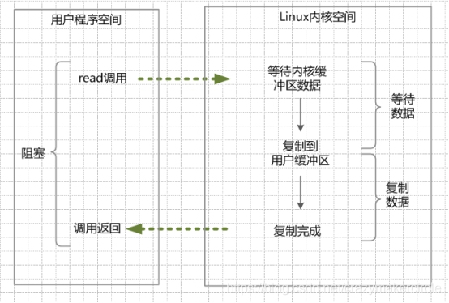
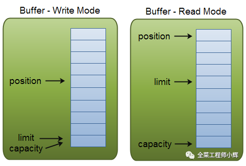
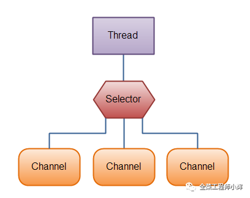

## BIO

同步阻塞IO（Blocking IO）,需要内核IO操作彻底完成后，才能返回用户空间。

## NIO
同步非阻塞IO（Non-blocking I/O，在Java领域，也称为New I/O）。底层使用IO多路复用。
### IO多路复用
通过系统调用，一个进程可以监视多个文件描述符，一旦某个描述符就绪，内核kernel就能够通知程序进行相应的IO系统调用。常见的IO多路复用有select、poll、epoll。
- select：轮训遍历fd，返回描述符读写是否就绪，返回时是返回所有fd，用户自己遍历拿取读写就绪fd，单个进程可以打开的fd数量有限制，默认是1024。
- poll：与select基本一致，只是采用链表存储fd，没有数量限制。
- epoll：当文件描述符发生改变时（读，写），发出读写信号，存储结构采用红黑树（监控fd）+链表（就绪fd），可读、可写是操作系统回调告诉epoll，返回给用户的只有就绪的fd。返回的文件是通过内核与用户空间共享一块内存传递，减少拷贝（不用从内核空间拷贝到用户空间）。
  - 水平触发：当缓冲区可以读写时，返回读写就绪，如果没有一次把数据读写完（如缓存区太小），下次调用时，依然会把没读写完的fd进行通知，。
  - 边缘触发：当缓冲区可以读写时，返回读写就绪，没有读写完的fd，下次不会继续通知。只有epoll有边缘触发，select和poll都是水平触发。

### Java NIO核心
- channel：所有的IO在NIO中都是从一个channel开始的，可以从channel读取buffer数据，也可以从channel将数据写入buffer
- buffer：一块写入、读取数据的内存。Java NIO中对基础类型都包装了buffer，如ByteBuffer、CharBuffer、IntBuffer等。buffer关键属性是capacity（容量）所能存储的最大值；position（位置）下一个写入读取数据的位置；limit（限制）读模式，还可以读多少，写模式，还可以写入多少。

- selector：单线程处理多个channel（IO多路复用），channel可以注册的事件有新连接、可读、可写。

## AIO
异步非阻塞IO（asynchronous I/O），与NIO相比，把selector所做的事情，交给操作系统，只会通知读写事件，其余与NIO基本一致。且在linux下NIO与AIO实现方式一致，都是epoll。

## 参考

[彻底搞懂NIO效率高的原理](https://cloud.tencent.com/developer/article/1488086)

## BIO、NIO、AIO区别
- 监听fd数量：BIO是单个，NIO与AIO都是多个
- 读取写入方式：BIO是从内核空间复制到用户空间，NIO与AIO是内存映射，不存在额外内存拷贝
- 关注事件：BIO没有事件，NIO关注连接、读、写，AIO关注读，写