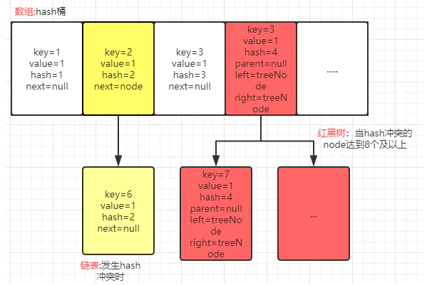

## 背景

HashMap是为了以O(1)的复杂度存取元素而设计的

ConcurrentHashMap是在HashMap基础上加上高效解决并发问题而设计的

## HashMap实现原理

- 数据结构：第一层是一个桶，可以看做是一个数组。单个桶里面是链表，链表存储的是Hash冲突的值。当极端情况下，所有元素都hash到一个节点里面，都放在链表里面，时间复杂度就变成了O(n)，所以JDK8，当链表长度大于8时就会转变为红黑树，这样哪怕最差的时间复杂度也是O(logn)

- 扩容：当放置元素越来越多，桶的大小不变的化，就会导致冲突元素越来越多，降低存取速度，所以HashMap会有个扩容因子，默认为0.75，当放置元素超过这个比例就会进行扩容。HashMap的大小总是2的n次方，方便扩容与缩小，用hash&（2^n - 1）就是索引位置。

## ConcurrentHashMap实现原理

- 数据结构：ConcurrentHashMap与HashMap结构大致相似，JDK7多了一层分段锁结构segment，每个segment下都可以看做有一个HashMap，JDK8去掉了segment，加锁级别变为了有hash冲突的Node，更大的提升了并发效率
- 并发安全：JDK7是segment继承ReentrantLock达到全局并发安全的，JDK8是通过synchronized锁Node来达到线程安全

## ConcurrentHashMap如何保证线程安全

查看ConcurrentHashMap实现原理