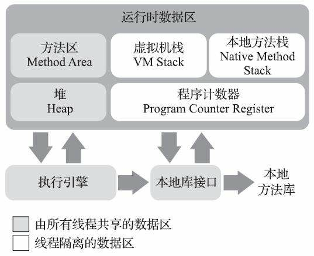
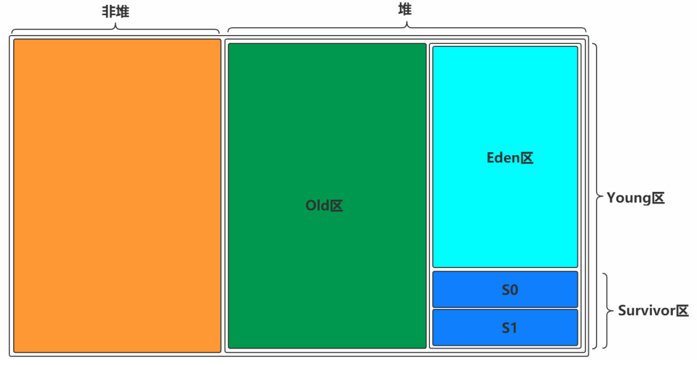
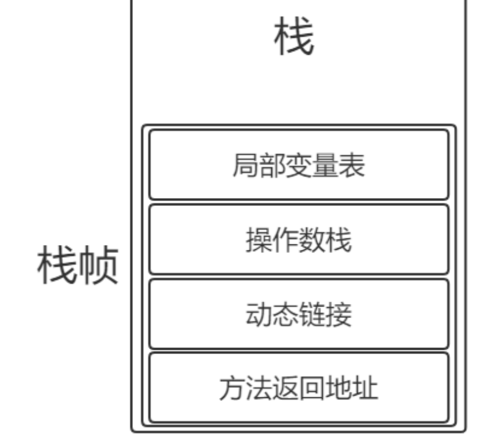
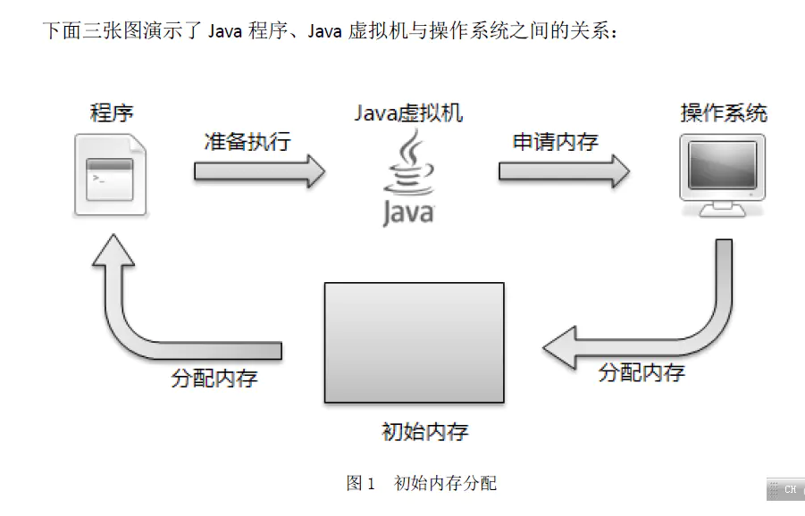
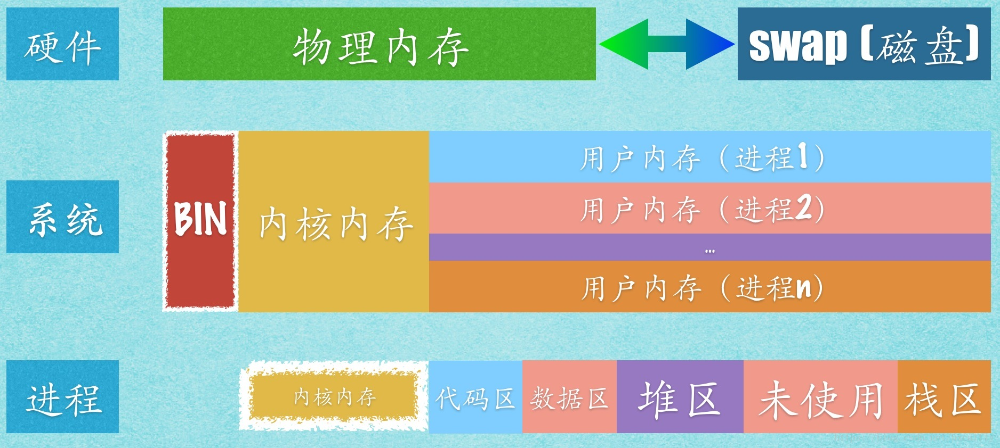

## JVM内存模型

### 方法区
- 各个线程共享区域，JDK7是永久代，JDK8是元数据
- 用来存储被虚拟机加载的类信息、常量、静态变量、编译后的代码等数据
- 无法分配内存时，会抛出内存溢出异常

### 堆

- 线程共享，最大的一块内存区域，存储对象与数组
- 年轻代内存划分比例默认为8:1:1

### 虚拟机栈

- 线程独有
- 存储的栈帧为执行的方法，每一个方法一个栈帧
- 栈帧中存储着对应方法的局部变量，方法返回地址，动态连接（只想本地方法栈）、操作数栈

### 程序计数器
- 执行字节码的行号指示器
- 执行Java方法，虚拟机字节码指令地址
- 执行本地方法，计数器为空

### 本地方法栈
- 执行本地方法时放入本地方法栈

## JVM内存与操作系统内存对应
JVM从操作系统申请内存

JVM内存在操作系统中如何存在

JVM内存与操作系统内存结构相似

