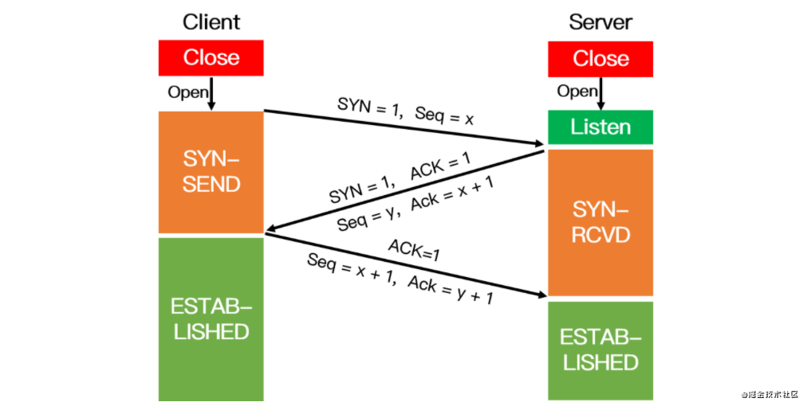
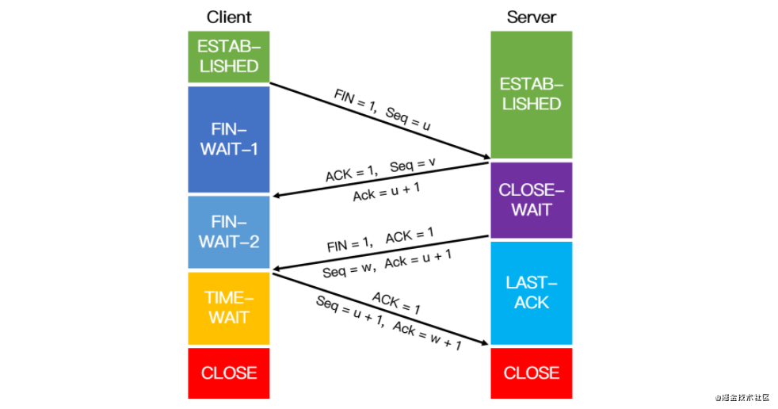
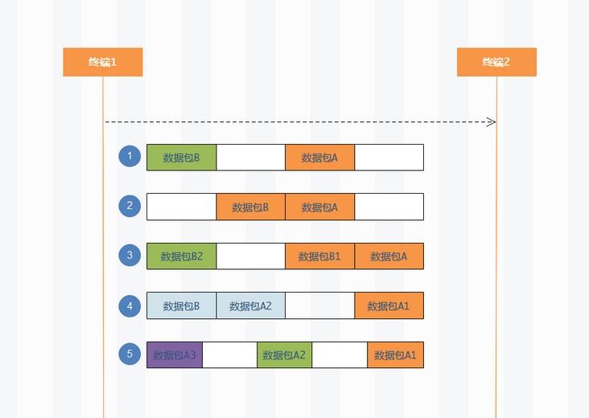
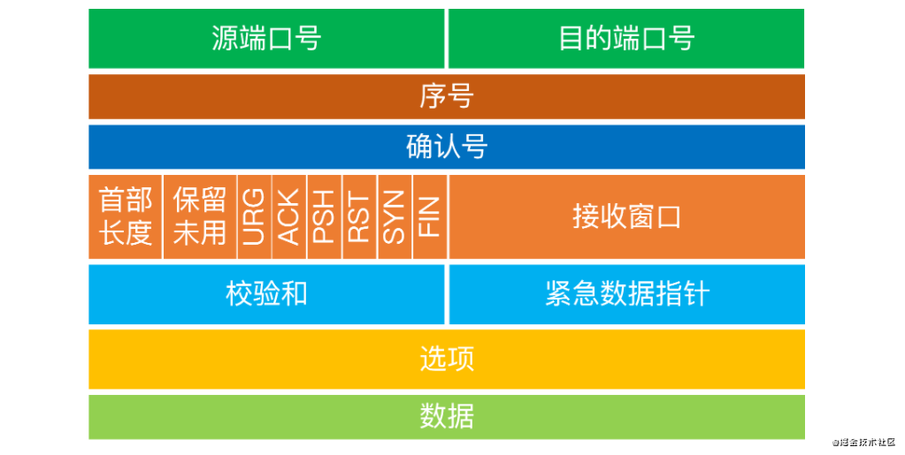

## 简述 TCP 三次握手以及四次挥手的流程。为什么需要三次握手以及四次挥手？
### 三次握手

1. 客户端请求建立连接：SYN-标志请求建立连接，Seq-表明本次请求的序号
2. 服务端确认接收到建立连接请求：SYN与 ACK同为标志位-表明能正常接收客户端发送数据，同意创建连接。同时发送自己的序列号 Seq， Ack为客户端Seq值+1
3. 客户端确认收到服务端同意建立连接请求： ACK标志是确认收到服务端同意建立连接请求， Ack为服务端的序列号+1， Seq为服务端返回的Ack确认值
### 四次挥手

1. 客户端请求释放连接：FIN-标志请求释放连接，Seq-本次请求序列号
2. 服务端确认收到释放连接请求：ACK标志确认收到请求，Ack为客户端序列号+1，Seq为本次请求序列号
3. 服务端数据发送完后，服务端发送准备好释放连接请求： FIN与 ACK为标志位，确认收到释放连接请求与准备好释放连接请求， Ack为客户端序列号+1， Seq为本次请求序列号
4. 客户端确认接收到服务端准备好释放连接请求：ACK标志确认请求，Seq为序列号，值为服务端发送的准备释放连接请求的 Ack值， Ack确认序列号，服务端序列号+1

### 为什么需要三次握手以及四次挥手
- 讨论前提：网络是不可靠的，需要服务端与客户端彼此可以通信或者关闭端口
- 三次握手：需要知道彼此可以通信，需要两次，而网络是不可靠，第二次有可能丢失，如果没有第三次握手，服务端就不知道客户端是不是知道自己准备好通信了。三次握手达到目的后就没必要进行第四次握手了。
- 四次挥手：释放连接时，多了一个阶段，等待数据传输完，所以相比建立连接，多了一次

## 简述 TCP 的 TIME_WAIT
在释放连接时，客户端在发送了最后Ack确认收到服务端准备好释放连接请求后，进入2MSL（Maximum Segment Lifetime报文传输最大生命周期）
- TIME_WAIT原因：数据包有可能在服务端的 FIN之后达到；没有 TIME_WAIT，可能导致新的连接使用这个端口造成数据错误
- TIME_WAIT问题：当高并发短连接时，服务端主动关闭连接，可能会有很多 TIME_WAIT，资源被占用，可以设置 SO_REUSEADDR让建立连接时可以使用 TIME_WAIT的 fd

## TCP 四次挥手的时候 CLOSE_WAIT 的话怎么处理？
1. 检查代码：查看是否是代码未关闭连接
2. 调整参数：调整 CLOSE_WAIT的等待时间，默认为2个多小时，可以缩短这个时间

## TCP 与 UDP 在网络协议中的哪一层，他们之间有什么区别？
在传输层，区别如下

| 类型 | 面向连接 | 传输可靠性 | 传输形式   | 传输速率     | 所需资源     |头部字节       | 应用场景           |
| :--- | -------- | ---------- | ---------- | ---- | ---- | ----- | ------------------ |
| TCP  | 是       | 是         | 字节流     | 慢   | 多   | 20-60 | 传输文件、http通信 |
| UDP  | 否       | 否         | 数据报文段 | 快   | 少   | 8     | 即时通讯、DNS转换  |

## 从系统层面上，UDP如何保证尽量可靠？
自己处理超时与重传

## TCP 怎么保证可靠传输？
1. 数据分块：应用数据被分成最适合发送的数据块
2. 序列号和确认应答：TCP发送的每个包都有序列号，接受方收到数据包会确认应答（有确认序列号，告诉发送方数据从哪发），并且会根据序列号对数据进行排序、去重给到应用层
3. 校验和：保持首部和数据部分校验和，检测数据在传输过程中的任何变化
4. 流量控制：发送接收方都有固定大小缓冲空间，当接收方来不及处理数据，会提示发送方降低发送的速率。TCP使用滑动窗口协议来支持流量控制机制
5. 拥塞控制：当网络某个节点发生拥塞时，减少数据的发送
6. ARQ协议：每发完一个分组就停止发送，等待对方确认，在收到确认后再发下一个分组
7. 超时重传：TCP发出一个报文段后，启动一个定时器，如果超过某个时间还没收到确认，将重发这个报文

## TCP 中常见的拥塞控制算法有哪些？
- 慢开始：由小到大的增大发送窗口，初始时令 cwnd为1，每收到确认报文，令 cwnd=cwnd\*2；为了防止 cwnd过大引起网络阻塞，另外设置了一个慢开始门限 ssthresh，当 cwnd>ssthresh时，转而使用拥塞避免
- 拥塞避免：让拥塞窗口 cwnd缓慢的增大，每经过一个往返时间RTT（发送方发送数据到接收到确认报文时间），通过线性增长，防止很快就遇到网络拥塞状态
- 快重传：接收方每收到一个失序的报文，就立即发送重复确认，而不要等到自己发送数据时，才捎带确认。因为发送方尽早重传未被确认的报文段，可以提高网络的吞吐量
- 快恢复：发送方收到三个重复确认，慢开始门限 ssthresh值减半；把 cwnd设置为ssthresh减半的值，然后执行拥塞避免，线性增大cwnd

## TCP 的 keepalive 了解吗？说一说它和 HTTP 的 keepalive 的区别？
- TCP的 keepalive：保活探测，当一个TCP连接，客户端很久没有向服务端发送数据了，服务端需要确认客户端还在不在，会自动发送一个数据为空的侦测报文，如果重试多次都没有返回时，认为没有必要保持连接
  - tcp_keepalive_time：闲置多少时间发送探测包
  - tcp_keepalive_intvl：间隔多少时间发送一次探测包
  - tcp_keepalive_probes：尝试多少次探测包后，认为没有必要保持连接
- 与 HTTP的 keepalive区别：HTTP的 keepalive是为了连接复用，节省同一客户端多个请求创建连接和关闭连接开销。 TCP的 keepalive是保活探测确认客户端是否还在线

## 简述 TCP 滑动窗口以及重传机制

- 滑动窗口：分为发送方和接收方的滑动窗口
  - 发送方：将数据根据是否发送与是否 ACK分为4组，每收到一个发送 ACK就移动，当久未收到 ACK就会超时重传。
  - 接收方：接收方缓存区存在三种状态，已接收、未接收准备接收、未接收并未准备接收，并会把能接收大小放在 TCP头部传给另一方，控制流量
- 重传机制：当 TCP发送报文段时，创建特定报文的重传计时器，在截至时间前收到 ACK，撤销计时期；在截至时间未收到 ACK，重传报文，并重置计时器

## 什么是 TCP 粘包和拆包？

- 拆包：TCP会把发送的数据分为适合的大小发送，当数据量太大时，会进行拆分发送，如1、5
- 粘包：，两个独立业务请求数据包可能会合在一起发送，当数据包较小或者当发送速度大于接收方的处理速度会发生粘包，如2、3、4
- 如何处理
  - 添加长度字段：服务端读取时，读取响应长度内容
  - 固定消息长度：服务端读取固定长度内容，当不够长时，补空
  - 设置消息边界：客户端设置特定特定字符为边界，服务端根据字符分离消息

## 简述 TCP 协议的延迟 ACK 和累计应答
- 延迟 ACK：也称延迟应答，当服务端收到消息时，不是立即回 ACK给客户端，而是等一段时间，这样如果服务端有数据要返回给客户端，就可以把数据和 ACK一起发给客户端了
- 累计应答：客户端发送多个数据段，服务端都收到了数据段，分别发送回去 ACK，中间某一次的   ACK网络原因丢失，客户端会根据最大的ACK接着发送后面的包

## 简述 TCP 的报文头部结构

- 源端口号与目的端口号：客户端发起连接端口号与服务端监听端口号
- 序号与确认号：请求的序号，一个字节一个序号，序号保证了TCP的有序性，确认号表明想要获得的下一字节
- 首部长度：20字节+可选项内容
- 保留：为以后可能用途保留
- 控制位：URG-紧急指针标志； ACK-确认标志； PSH-push标志，应尽快交给应用层； RST-重置连接，拒绝非法请求； SYN-同步序号，请求建立连接； FIN-finish请求释放连接
- 接收窗口：告诉发送方缓存区大小，以便让发送发控制发送速率
- 校验和：对TCP头部和数据项校验和，判断数据是否有修改
- 紧急数据指针：告知紧急数据所在位置，当控制位 URG为1时，会通知上层应用，采取响应处理

## 简述 TCP 半连接发生场景
- 半连接：三次握手时，当服务端返送 SYN与 ACK后等待客户端 ACK，进入 SYN RECV为半连接状态

## 什么是 SYN flood，如何防止这类攻击？
- SYN flood：通过重复发送初始连接请求（SYN），攻击者能够消耗服务器可用资源，创建大量半连接，使服务器无法处理合法请求
- 防止攻击
  - 过滤：识别出恶意 ip，过滤掉恶意 ip的初始连接请求（作用不大，因为很难识别出恶意ip）
  - SYN Cache：维护一个 HashTable，桶满时丢弃之前的半连接，半连接成为全连接时，分配传输资源并从 HashTable中移除
  - SYN Cookies：服务端发送 SYN与ACK时，将半连接信息一同发送给客户端，当客户端第三次握手时才真正分配资源。因为没有维持半连接，不能超时重传，存在的问题是误判，客户端发送第三次握手后，就开始传输数据，但这时第三次握手可能丢失，服务端没有创建连接，导致不能通信
  - SYN Proxy：客户端与服务端直接设置代理，由代理与服务端通信