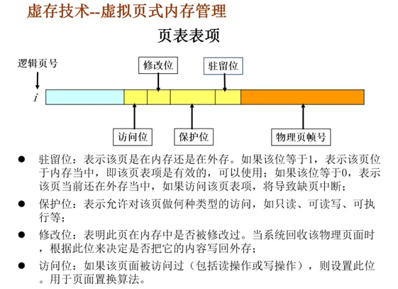
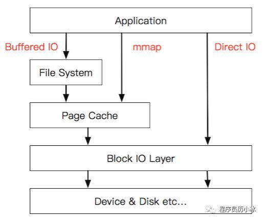

## 操作系统如何申请以及管理内存的？
- 申请内存：当小于128k时，brk 移动\_edata 指针，当大于128k时，mmap 寻找空闲的空间分配
- 内存管理
  - 分配与回收：分配 brk 与 mmap，brk先分配的必须等后分配的回收后才能回收，超过一定期限压缩
  - 内存空间扩充：利用虚拟存储，从逻辑上扩充内存，页表存储逻辑地址与物理内存的映射关系，为了解决地址过大与效率问题，分别有 TLB 缓存与分页页表（倒排页表与散列表）。当内存满时不同的页面置换算法换出分页。分页存储了索引与标志位及物理页帧号
  
  - 地址转换：逻辑地址转换成相应的物理地址（页表）
  - 存储保护：保证各道作业在各自催存空间中运行，互不干扰
## 简述操作系统中的缺页中断
程序执行时，需执行的指令或访问的数据尚未在内存中，由处理器通知操作系统将相应的页面或段调入到内存中（内存不足时，需要从内存中调出一个页面到磁盘交换区）
## 简述操作系统中 malloc 的实现原理

## Linux 中虚拟内存和物理内存有什么区别？有什么优点？
- 区别：虚拟内存是将使用内存切割成小型固定大小的页，物理内存划分成与虚拟内存页尺寸相同的页帧。程序可以只有部分页在物理内存页帧中，未使用的页会拷贝保存到磁盘空间的交换区，需要使用的时候，发生缺页中断加载到物理内存中。（虚拟内存内存管理利用时空局部性更好的利用CPU与物理内存，即程序倾向于访问最近访问过的内存地址）
- 优点
  - 程序隔离，进程与进程，进程与内核，保证安全性
  - 共享内存，统一程序启动多个进程，共享代码段，进程间通信共享内存
  - 无需关注物理内存布局
  - 程序所占内存可以超过物理内存大小，按需加载，加快速度
## 简述 mmap 的使用场景以及原理
将虚拟内存区域与磁盘上对象关联起来，读取时 mmap 比传统read 快很多，写入时小文件mmap比较快。应用场景为读取文件，比如NIO读取数据，RocketMQ mmap+异步刷盘提升性能，减少用户态与内核态的拷贝
### mmap过程

1. 建立虚拟内存与磁盘对象映射
2. 读取mmap映射地址时，发现未加载到内存中，发生缺页中断，加载到Page Cache 中，再读取到应用程序中（应用程序是用堆栈之间空白内存映射）
3. 发生写入时，有两种策略，共享-写入文件，其他进程能看到；私有-利用 copyOnWrite，其他进程看不到。同时 PageCache 同步也有两种策略，写穿（Write Through）-写入 PageCache 时，同时写入磁盘，才返回；写回（Write Back）-写入PageCache即返回，通过pdflush（Page Dirty Flush）写入磁盘，有时间间隔、比例、大小这几个维度去考虑同步

## 简述 Linux 零拷贝的原理
- 用户态与内核态：内核态控制计算机的硬件资源，例如协调CPU 、分配内存。用户态是应用程序运行空间，用户态与内核态通过系统调用互通。
- 零拷贝原理：零拷贝即减少用户态与内核态的拷贝，实现方式一般有两种
  - sendfile：不把数据拷贝到用户态，而直接发送到Socket 上，原先为 file->内核态->用户态->内核态->Socket，使用sendfile 为file->内核态->Socket
  - mmap：建立虚拟内存到磁盘映射，不用拷贝内存

## 参考
- [CS-Notes](https://github.com/CyC2018/CS-Notes)
- [聊聊Linux IO](https://cloud.tencent.com/developer/article/1549926?from=information.detail.linux%20mmap%E4%BD%BF%E7%94%A8%E5%9C%BA%E6%99%AF)
- [mmap的实现原理和应用](http://www.360doc.com/content/20/0720/16/36242867_925580123.shtml)

