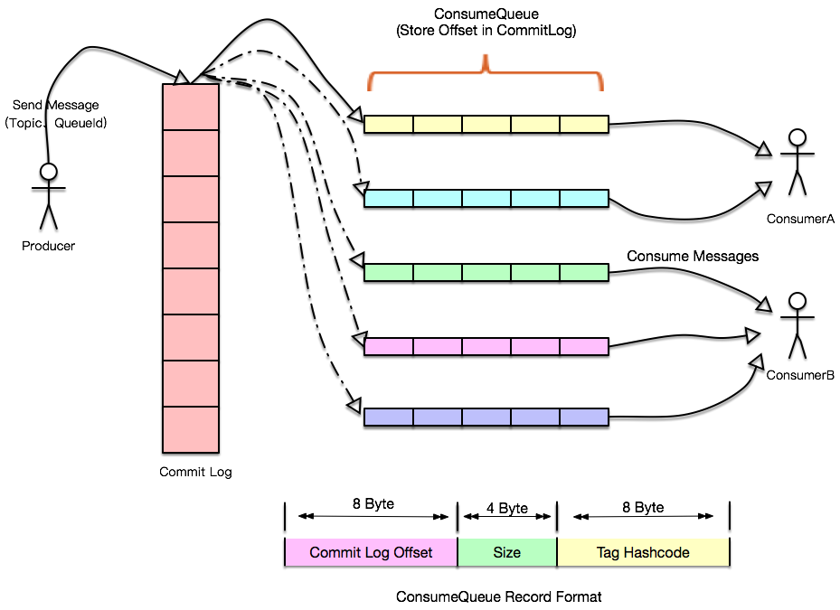
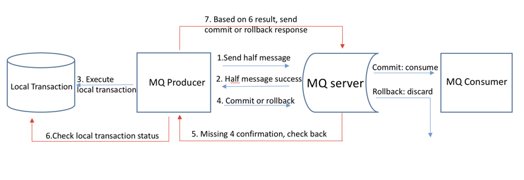

## 架构

### NameServer
`RocketMQ`的注册中心，每个 NameServer 保存着全量的路由信息。 Broker 启动时将自身信息注册在 NameServer 上。Producer 与 Consumer 从 NameServer 获取 Broker 的路由信息。NameServer 是`AP`模型，保持最终一致性。
- 一致性：Broker 注册后会30秒发送一次心跳；NameServer会每10秒自检一次，当 Broker 超过120秒没有发送心跳包后，移除 Broker；客户端也会每30秒更新一次路由信息，当恰好在定时任务的间隔访问挂掉的 Broker 可以使用重试机制

### Broker
`RocketMQ`的服务，作用是存储与转发消息，消息有三个主要属性
1. Topic：消息主题，分为读写队列，写队列是一个 Broker 上这个 Topic 有多少个MessageQueue ，读队列是有多少个消费者可以消费，当读队列比写队列少时，消息会消费不到。分为读写队列是为了动态扩容缩容
2. tag：主题下可能有多重操作特性，做标识
3. Group：同一角色分为一组，集群模式下，动态扩展容量，实现消息的负载均衡与消息容错（事务消息生产者挂掉时，事务回查）

#### 存储设计
消息存储相关文件如下

- commitlog：消息存储目录，Broker 上所有接收消息都存储在这里，顺序存储。每个文件默认1G ，当超过大小下一个文件以偏移量起名重启开始存储。利用 PageCache 在异步刷盘方式下（先写PageCache的内存，再pdflush以某种策略flush回磁盘），性能和内存差不多，同时RocketMQ主要通过MappedByteBuffer对文件进行读写操作，减少内核与用户区拷贝，从而极大地提高了文件的读写效率（正因为需要使用内存映射机制，故RocketMQ的文件存储都使用定长结构来存储，方便一次将整个文件映射至内存）

- consume queue：提高消息消费性能，查询消息时都是先查询 consume queue，再查 commit log，Tag Hashcode 用于拉取消息时过滤，另外一种过滤是 SQL92，为避免每次执行SQL过滤影响性能，使用布隆过滤器。

- index：消息 hash 索引文件存储目录
- config：运行时的配置信息，包括 Topic属性、Group信息、Group消费进度等
- checkpoint：文件检查点，最后一次刷盘时间或时间戳

#### 消息刷盘

分为同步刷盘与异步刷盘
- 同步刷盘：只有消息真正持久化到磁盘，才会返回 ACK ，对性能影响较大
- 异步刷盘：充分利用 PageCache 的优势，只要写入 PageCache ，即返回 ACK

#### 消息清除
被消费过的消息不会删除，随着文件增大，默认超过72个小时的文件，会在凌晨4点清除。磁盘使用率超过90%时拒绝消息写入

### Producer
生产者，发送消息，发送逻辑一致的 Producer 可以组成一个 Group
- 消息发送规则：hash方式选择 MessageQueue （默认）、随机选择 MessageQueue、空实现

#### 延迟消息
1. Producer 发送某个 Topic 的延迟消息
2. Broker 收到消息后，判断是延迟消息，使用临时存储存储起来
3. Broker 内部通过 delay service 判断消息是否到期，到期后将消息投递到对应 Topic
4. 消费者消费延迟消息

### Consumer
消费者，消费消息，消费逻辑一致的 Consumer 可以组成一个 Group。Consumer消费消息分为推和拉，RocketMQ的推，其实也是通过拉实现。消费方式分为广播和集群，对同一个Group，广播消息所有消费者都能消费到，集群消息只有一个消费者能消费到。

- 负载均衡：消费消息是在Consumer 端做的负载均衡，主要通过 RebalanceImpl 实现。先获取 Group 下消费者id列表，根据算法分配 MessageQueue （默认是均匀分配），再与现在的processQueueTable 作比较，更新processQueueTable。核心是一个MessageQueue 对一个Group 内的消费者，同一时间只能被一个消费者消费。
  - AllocateMessageQueueAveragely（默认）：平均分配
  - AllocateMessageQueueAveragelyByCircle：轮流一人一个
  - AllocateMessageQueueByConfig：通过配置
  - AllocateMessageQueueConsistentHash：一致性hash
- offset存储：消费进度存储，有两种实现LocalFileOffsetStore 与RemoteBrokerOffsetStore
  - LocalFileOffsetStore：存储在本地，为广播模式默认方式
  - RemoteBrokerOffsetStore：存储在Broker 上，为集群模式默认方式

## 常见问题
### 如何保证消息不丢失
1. Producer：ACK机制（强要求时，可以设置Broker 同步刷盘），失败重试机制
2. Broker：可以设置同步刷盘，主从模式避免单点故障
3. Consumer：消费完后，ACK 确认

### 消息重复消费
- 原因：网络导致ACK 慢送达，导致在此消费。不同Group 订阅相同Topic 重复消费。
- 解决：消息冥等；消费前查询是否已消费过
### 顺序性
1. Producer 是单线程同步发送，发送到同一个queue ，使用相同的hashkey
2. Producer 发送的消息路由到相同的 MessageQueue
3. Consumer 加锁单线程消费
### 事务性

1. 发送半消息到`RocketMQ`
2. 半消息刷盘，回应成功
3. 执行本地事务
4. 根据本地事务执行结果，提交或者回滚之前的半消息
5. 未收到确认半消息通信时，发起消息回查（默认回查15次，每次间隔60秒）
6. 检查本地事务状态
7. 根据本地事务状态提交或者回滚之前的半消息

### 消息堆积如何处理
1. 上线做转发的consumer，转发到新的Topic 下，新Topic下读写队列配置多一点
2. 上线更多的consumer，快速消费

## 参考
[RocketMQ Architecture](http://rocketmq.apache.org/docs/rmq-arc/)
[design](https://github.com/apache/rocketmq/blob/master/docs/cn/design.md)
[The Design Of Transactional Message](http://rocketmq.apache.org/rocketmq/the-design-of-transactional-message/)
[RocketMQ高性能之底层存储设计](https://my.oschina.net/wangen2009/blog/3012710)
[offset管理](https://www.jianshu.com/p/b4970f59a8b1)
[常见问题及答案](https://www.cnblogs.com/javazhiyin/p/13327925.html)
[消费场景解析](https://www.jianshu.com/p/d369f0b8168c)