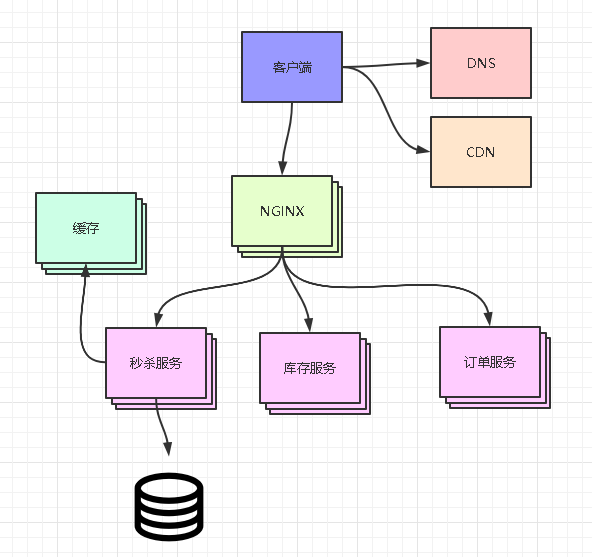

##  需求
- 功能性需求
  - 固定时间点秒杀商品
  - 不能超卖和少卖
- 非功能性需求
  - 瞬时流量会很大
  - 避免恶意抢购
## 秒杀表设计
秒杀系统作为一个单独的服务，避免影响其他业务的正常使用
```java
主键
商品编码
秒杀数量
秒杀价格
活动名称
活动编码
创建时间
更新时间

商品编码建立索引
```
## 活动步骤
1. 用户到时间点击秒杀
2. 在商品够得情况下秒杀成功
3. 用户支付完成秒杀

在这个过程中需要注意的是什么时候减库存。减库存可以三种方式，下单减、支付减、预扣除。下单减时，会有抢购到但未支付的情况。支付减会导致大量用户无法支付，用户体验查。一般使用的是预扣除，即下单减，一段时间未支付恢复库存。

## 固定时间抢购与恶意抢购
前端计时，请求后端，后端到达固定时间再返回秒杀地址跳转。校验用户真实性，限制用户抢购次数等。

## 瞬时流量很大
针对秒杀活动，只有少部分请求是最终有效地，生成订单，完成支付。可以使用缓存与业务限制达到只有少量请求打到数据库。
1. 前端限制多少时间内只能点击一次，避免重复请求，还可以秒杀时回答问题，过滤脚本与减少请求
2. 后端可以限制请求量，超过请求直接返回秒杀失败
3. 使用缓存，因为大部分请求都是读，使用缓存这一层，可以过滤掉大部分请求

## 不能超卖和少卖
因为使用了缓存，可以使用redis事务，避免超卖。定时任务去将超时未支付的库存加回来，避免少卖。

## 架构图



