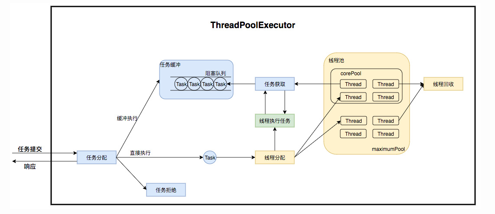
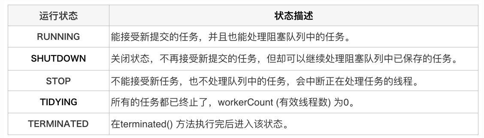
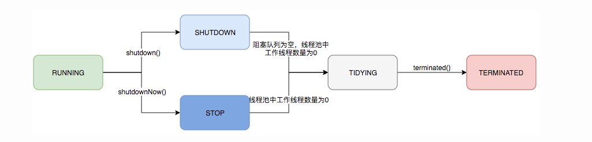

## 解决的问题

- 频繁申请、销毁、调度线程资源，消耗可能会非常大
- 对资源无限申请缺少抑制手段，有资源耗尽的风险
- 系统无法合理管理内部的资源分布，降低系统问题性

## 核心

线程池的核心是对任务与线程的管理。

- 提交任务后，任务怎么处理
- 线程池中线程什么时候创建、回收、线程多大的数量
- 线程池中线程如何与任务关联上

- work线程管理
  - work线程：继承 AQS（独占锁判断线程是否还在运行） 与Runable（获取任务，非核心线程超过一定时间未获取到任务结束，消除hash表的引用），线程池用hash表持有对线程的引用，当线程需要回收时，清除 hash表对线程的引用，由 GC 回收
- 其余的设置超时时间、拒绝策略都是随着应用需求而发展起来的

### 生命周期

## 高并发情景下，核心线程池该如何设置参数

### 常规设置

- CPU密集：N+1，多个缺页中断
- IO密集：2N，IO多是等待，不使用CPU

### 实际情况

- 快速响应型：不应该放置在队列中，使用同步队列，corePoolSize 与 maxPoolSize尽量调大执行任务
- 快速批量任务：调整合适的corePoolSize ，用队列缓冲
- 动态调整：先设置一个初始值，添加监控与实时调整，根据运行情况动态调整

## 参考

- [Java线程池实现原理及其在美团业务中的实践](https://tech.meituan.com/2020/04/02/java-pooling-pratice-in-meituan.html)