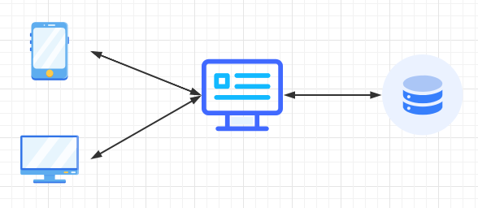
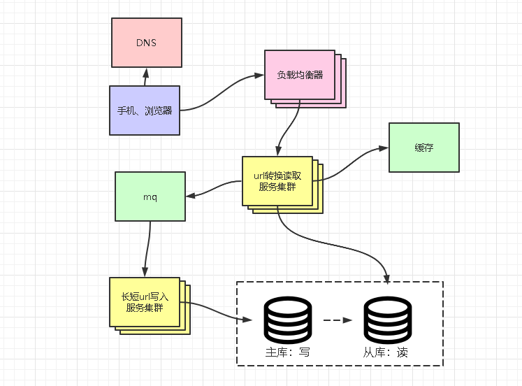

## 需求

- 功能性需求
  - 输入长 url 返回短 url
  - 访问短 url 重定向到真正地址
- 非功能性需求
  - 流量较大
  - 扩展与缩小规模

## 初始设计


## 长 URL 变短 URL 方案
1. 全局自增ID（数据库或者redis），转为base62
2. uuid，长度比base62 要长，为32位

## 数据库设计
```java
id int 主键自增
longUrl vc600 长 url
shortUrl vc20 短 url
createTime timestamp 创建时间
updateTime timestamp 更新时间
shortUrl建立索引
```
## 非功能性需求设计
### 流量较大
带来的几个问题
1. 单体服务无法抗住大量请求
2. 大量请求可能把数据库搞崩
3. 随着数据增多，数据库越来越慢

针对无法抗住大量请求，可以使用负载均衡，减轻单体服务压力。

大量请求把数据库搞崩，可以增加缓存层，与读写分离，同时针对单时刻流量巨大，可以使用mq削峰填谷，平滑的写入数据库。

数据变多，数据库变慢，如果 ur l 有过期时间，可以定时删除超过一定时间的数据；如果 url 没有过期时间，可以使用分库分表，因为长 url 可以不用获取同一个短 url ，可以使用短url hash分库分表。
### 扩展与缩小规模
- 代理动态的添加删除服务
- 单个服务设置限流的大小

## 最终架构


