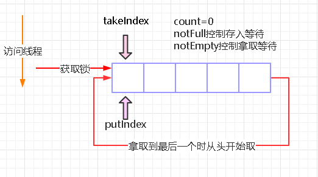

##  需求
- 功能性需求
  - 数据的存入与拿取
  - 当没有数据时，拿取阻塞
  - 当数据满时，放入数据阻塞
- 非功能性需求
  - 线程安全
  - 根据场景易扩展

## 功能性需求分析
- 数据的存入与拿取：数据的存入和拿取需要选用适合的数据结构，单个数据的放置与拿取可以选取 数组、链表、堆、栈、队列等
- 存取数据时阻塞：可以用 synchronized 内的 wait ，也可以用 Condition 的 wait


## 线程安全
对于线程安全可以有如下几种方式
1. 使用 synchronized 进行加锁
2. 使用 ReentrantLock 进行加锁
3. 利用 CAS 进行线程安全的放入与拿取

对于 synchronized 与 ReentrantLock 锁存入与拿取可以公用一个锁也可以用两个锁，用两个锁，粒度要小些，并发性能更好。CAS 进行存入与拿取是并发性能最好的。

## 易扩展
提一层接口，各场景根据自己需要实现接口，完成适合自己的阻塞队列
```java
public interface BlockingQueue<E>{
    void put(E e) throws InterruptedException;
    E take() throws InterruptedException;
}
```
## 实现举例- ArrayBlockingQueue
各个场景的阻塞队列实现即是存储数据结构与线程安全实现方法组合，ArrayBlockingQueue（有界阻塞队列）即为数组+ ReentrantLock + Condition 实现的阻塞队列。



